# OpenEMR System Audit

## Executive summary

OpenEMR is a mature, three-generation PHP codebase (legacy `library/`
procedural code, an `interface/` UI layer, and a modern PSR-4 `src/`
layer) providing full EHR functionality — clinical charting, billing,
scheduling, a REST/FHIR API, and a patient portal — for the 30-patient
Synthea-seeded dev stack this audit examined. This pass covered security,
performance, architecture, data quality, and HIPAA compliance, producing
87 findings (10 High / 37 Medium / 25 Low / 15 Info) recorded in full in
[`audit-long.md`](../audit-long.md).

**Security.** The single most important theme, spanning 14 of the 52
security findings, is that many endpoints rely on the UI menu hiding a
link rather than calling the codebase's own `AclMain::aclCheckCore()`
authorization check — direct URL access bypasses this entirely. On top of
that pattern, two High-severity, narrowly-reachable issues stand out: an
unvalidated query-parameter name becomes a SQL column name in the REST
search layer, giving a portal patient (the lowest-privilege account type)
an arbitrary-table database read; and a missing superuser-inclusion check
in one ACL-management endpoint lets any ACL-privileged non-superuser grant
themselves full superuser access. Session fixation (no session ID
regeneration on login), four reachable High-severity dependency CVEs, and
PHI stored plaintext and indefinitely outside the normal ACL model in
notification tables round out the top security findings.

**The audit log itself is the most consequential compliance gap.** It
contains unencrypted PHI (literal query parameter values, including
patient names and diagnoses) and computes a tamper-evidence checksum that
is written but never verified anywhere in the codebase — the one control
HIPAA §164.312(b) specifically requires is both a PHI-exposure surface and
non-functional as forensic evidence. A real, HIPAA-relevant breach
investigation would also be slowed by an unindexed date column on that
same log table.

**Operational constraints for anything built next.** No caching layer
exists anywhere (application config is reloaded from the database on
every single request); no cron or job queue runs by default, so any
after-hours or long-running feature needs an operator to add one; N+1
query patterns exist in shared service-layer code; and no
"encounter-finalized" domain event exists for a new feature to hook into.
Chart-assembly cost varies over 150x across patients in this seed alone.
On the data side, 99.8% of encounters in the seeded dataset reference a
facility ID that doesn't exist — an import artifact, but exactly the kind
of gap a new chart-assembly feature must defend against.

**The single most important recommendation:** before adding any new
capability — especially one that reads broadly across patient charts, as
an AI-summary feature would — fix the audit-log integrity gap (COMP-07/
COMP-08) and close the "menu-gated, not ACL-gated" authorization pattern.
Both are foundational: one determines whether the system can prove what
happened after the fact, the other determines whether "authorized" means
anything before the fact.

**Not covered:** dynamic/runtime penetration testing, `ccdaservice/` and
`gacl/` internals, most of `interface/forms/*`, production-scale data
volume (all findings here are from a 30-patient seed), and end-to-end
browser-timed page latency (blocked by tooling availability in this
container). See each section's "Not covered" for the full list.

---

# OpenEMR System Audit — Full Findings

Working document. Every significant finding from each audit is recorded here
first; the ~500-word summary and the final [`AUDIT.md`](AUDIT.md) are produced from this
file last. Task tracking lives in [`AUDIT_TASKS.md`](../AUDIT_TASKS.md).

**System under audit:** OpenEMR 8.2.0 (database schema v541, ACL v13), fork
of `Gauntlet-HQ/openemr-base-clean`, branch `audit`. The security section's
automated scans (§1.1) ran against HEAD `859ad84`; all subsequent manual
review (remainder of §1, and all of §2-§6) was performed against later
commits on the same branch (`11e0d6d`, `8939181`, and this audit's own
closing commit) with no code changes to the audited application in
between — only audit documents were added. All data in the dev stack is
synthetic (Synthea-generated); no real PHI is present.

**Severity scale:** Critical / High / Medium / Low / Info — exploitability and
impact, not confidence. Confidence is recorded separately where it matters.

---

## Findings register

Cross-audit ranking happens in §6 of the task list; this table collects every
finding by ID. `SEC-` security, `PERF-` performance, `ARCH-` architecture,
`DQ-` data quality, `COMP-` compliance.

| ID | Sev | Area | Location | One-line | Status |
|---|---|---|---|---|---|
| SEC-01 | High | Portal authz | `library/ajax/upload.php:140` | Portal patient can read/overwrite any patient's document by `doc_id` (CWE-639) | Fixed in 859ad84 (untested) |
| SEC-02 | Medium | Portal authz | `portal/lib/paylib.php:189` | Portal patient can write payment audit rows for any `form_pid` (CWE-639) | Fixed in 859ad84 (untested) |
| SEC-03 | Medium | Staff authz | `interface/patient_file/encounter/diagnosis.php:105` | Billing rows written before the coding ACL check runs (CWE-862) | Open |
| SEC-04 | Medium | Staff authz | `interface/patient_file/encounter/diagnosis_full.php:37` | Any user can add/deactivate/clear any billing row by id; no ACL (CWE-862) | Open |
| SEC-05 | Medium | Staff authz | `interface/patient_file/encounter/superbill_codes.php:51` | Any user can add charges from GET params; no ACL (CWE-862) | Open |
| SEC-06 | Medium | Staff authz / portal | `interface/patient_file/summary/create_portallogin.php:61` | Any user can reset any patient's portal credentials and log in as them (CWE-862) | Open |
| SEC-07 | Low | Staff authz | `interface/patient_file/summary/add_edit_issue.php:268` | Issue save path skips per-issue-type ACL (`aclCheckIssue`); non-default config only (CWE-862) | Open |
| SEC-08 | Info | Session scoping | `interface/patient_file/encounter/encounter_top.php` | `set_pid`/`set_encounter` bind the session to any patient with no ACL check — the primitive that makes SEC-03..06 reach every patient | Open |
| SEC-09 | Info | Defense in depth | `interface/super/edit_layout.php:598` | `copytolayout` branch lacks CSRF check; unexploitable because core cookie is `SameSite=Strict` | Open |
| SEC-10 | Info | Defense in depth | `interface/patient_file/front_payment_cc.php:85` | Unescaped exception text echoes raw `$_POST['payment']`; self-XSS only under `SameSite=Strict` | Open |
| SEC-11 | High | API / SQLi | `src/Services/Search/SearchFieldStatementResolver.php:293` | Query-parameter *names* become SQL column names unvalidated; arbitrary table read via REST search, reachable by portal patients on `/employer` (CWE-89) | Fixed in 9126051 (sink identifier check + controller allowlists; isolated unit test; runtime before/after reproduced on the dev stack — boolean-blind users-table read blocked) |
| SEC-12 | High | Reports / SQLi | `interface/reports/ippf_statistics.php:1456` | `form_facility` interpolated into stats query; full DB read by acct/rep user (CWE-89) | Open |
| SEC-13 | Medium | Reports authz | `interface/reports/patient_list.php:260` | Patient List report runs with no ACL check; bulk demographics + insurance to any user (CWE-862) | Open |
| SEC-14 | Medium | Reports authz | `interface/reports/charts_checked_out.php:83` | Chart-tracker report discloses patient names/IDs on GET, no ACL (CWE-862) | Open |
| SEC-15 | Medium | Reports authz | `interface/reports/unique_seen_patients_report.php:225` | Unique-seen report exports names+addresses, no ACL (CWE-862) | Open |
| SEC-16 | Medium | Reports authz | `interface/reports/patient_flow_board_report.php:417` | Flow-board report discloses appointment PHI + drug-screen status, no ACL (CWE-862) | Open |
| SEC-17 | High | Dependencies (PHP) | `composer.lock` | 19 advisories across 5 packages; 4 High (guzzle host-check bypass, phpspreadsheet ×3 DoS/SSRF), all reachable | Open |
| SEC-18 | Medium | Dependencies (JS) | `package-lock.json` | 5 moderate in shipped deps (dompurify XSS, jszip path-traversal/proto-pollution, dwv, fflate, validate.js ReDoS); 13 High/Critical are dev-only | Open |
| SEC-19 | Medium | Config / default creds | `docker/production/docker-compose.yml:13,37-41` | Production compose ships hardcoded `root`/`root` DB and `admin`/`pass` app creds with no env indirection | Open |
| SEC-20 | Low | Committed key material | `docker/library/*-ssl-cert-keys/`, `ci/nginx/dummy-key` | Real TLS private keys committed to the repo; dev/CI stacks only, not used by production compose | Open |
| SEC-21 | High | Session mgmt | `library/auth.inc.php:52-80` | No session ID regeneration on login (core or portal) — session fixation (CWE-384) | Open |
| SEC-22 | Medium | Session mgmt | `src/Common/Session/SessionConfigurationBuilder.php:83-122` | Core and portal session cookies ship `Secure=false` unconditionally (not HTTPS-derived); core cookie also `HttpOnly=false` by design (CWE-614/CWE-1004) | Open |
| SEC-23 | Medium | Authentication | `library/auth.inc.php`, `src/Common/Auth/MfaUtils.php:75-78` | TOTP/U2F MFA exists but is never invoked on the primary staff web login; only reachable via OAuth2 password-grant; no admin-enforceable "require MFA" setting | Open |
| SEC-24 | Low | Session mgmt | `src/Common/Session/SessionTracker.php:38-56` | No absolute session lifetime cap (idle-timeout only) and no concurrent-session limit per user | Open |
| SEC-25 | Medium | OAuth2 / API | `src/RestControllers/AuthorizationController.php:287-410` | Dynamic client registration (`/registration`) is unauthenticated; clients requesting only default scopes are auto-enabled with `oauth_app_manual_approval` off by default | Open |
| SEC-26 | Low | Portal authn | `portal/account/account.lib.php:242-302` | Self-service password-reset trigger gated on guessable PII (DOB+name+email), no dedicated rate limit beyond reCAPTCHA (distinct from SEC-06) | Open |
| SEC-27 | Medium | Staff authz | `library/ajax/person_search_ajax.php:115,353` | No ACL check: any authenticated user can search PHI (name/DOB/phone/email) and create new person records; stack trace echoed on error | Open |
| SEC-28 | Medium | Staff authz | `library/ajax/upload.php:131-149` | No ACL check on document upload/fetch: any authenticated user can write documents into any patient's chart; `doc_id` fetch not ownership-checked for core users | Open |
| SEC-29 | Low | Staff authz | `library/ajax/addlistitem.php:70` | No ACL check: any authenticated user can insert rows into `list_options` (system-wide reference lists) via GET | Open |
| SEC-30 | Medium | Staff authz / IDOR | `interface/patient_file/summary/pnotes_full_add.php:37-146` | `docid`/`orderid` request param (not session pid) determines which patient's chart notes are read/written; squad-checked but not pid-checked | Open |
| SEC-31 | Low | Upload validation | `interface/modules/zend_modules/module/Documents/.../DocumentsController.php:70-93` | Upload type gate relies on client-supplied `Content-Type`, not server-side sniffing; bounded impact since storage flows through the protected Document engine | Open |
| SEC-32 | Low | Upload validation | `oe-module-faxsms` `*Client.php faxProcessUploads()` | No MIME/extension validation before `move_uploaded_file()`; mitigated by storage outside webroot (`temporary_files_dir`, default `/tmp`) | Open |
| SEC-33 | Medium | Break-glass | `src/Common/Logging/BreakglassChecker.php`, `library/classes/Installer.class.php:1413-1436` | Break-glass ("Emergency Login") grants unscoped superuser-equivalent access, self-service with no justification/approval workflow, no rate limit, no dedicated review UI | Open |
| SEC-34 | High | Privilege escalation | `library/ajax/adminacl_ajax.php:44-84` | Missing superuser-inclusion check (present in sibling `usergroup_admin.php`) lets any `admin/acl`-privileged non-superuser add themselves to Administrators or Emergency Login group | Fixed in 7477e1c (also closes the control=aco admin/super variant; runtime before/after reproduced on the dev stack — escalation blocked, legit ops preserved) |
| SEC-35 | Low | CSRF | `interface/billing/search_payments.php:50-69` | `DeletePayments` POST handler has no CSRF check; ACL-gated, mitigated by `SameSite=Strict` | Open |
| SEC-36 | Medium | CSRF | `interface/billing/ub04_dispose.php`, `ub04_submit.php` | No CSRF check; handler accepts writes via GET (`$_POST[...] ?? $_GET[...]`), so only `SameSite=Strict` mitigates — no POST-only fallback defense | Open |
| SEC-37 | Low | Security headers | app-wide; `interface/login/login.php:31-32`, `portal/index.php:20-21` | No CSP/X-Frame-Options/Referrer-Policy outside login/portal entry pages; HSTS only present via Docker-image Apache config, not app-level | Open |
| SEC-38 | Low | Info disclosure | `src/RestControllers/Subscriber/ExceptionHandlerListener.php:50-56`, `AuthorizationController.php:628,1256,1416`, FHIR operation controllers | REST/OAuth/FHIR error responses return raw `$exception->getMessage()` to clients (traces stay server-side) | Open |
| SEC-39 | Low | PHI in logs | `src/Services/Cda/CdaTemplateImportDispose.php:2344,2371,2373` | CCDA import logs source filenames, which may embed patient name/MRN by convention (indirect, unconfirmed) | Open |
| SEC-40 | Medium | Export authz | `interface/modules/zend_modules/.../EncounterccdadispatchController.php:76` | CCDA/QRDA export controller takes `pid`/`pids` from request with no visible per-patient ACL check and no rate limit on batch export | Open |
| SEC-41 | Info | Export rate limiting | `src/RestControllers/FHIR/Operations/FhirOperationExportRestController.php` | Bulk FHIR system export has no abuse-rate limiting (only execution-time/retention bounds); full-population dump is an intended, scope-gated capability | Open |
| SEC-42 | Medium | Export/scraping | `interface/reports/patient_list.php:35-41,187-295` | Any authenticated user can CSV-export the entire patient list (name, DOB, address, phone) with no pagination or rate limit, beyond basic login+CSRF | Open |
| SEC-43 | Low | Transit encryption | `docker/flex/openemr.conf:145-159` | HTTP→HTTPS redirect is present in config but commented out / disabled by default; plain HTTP served on port 80 | Open |
| SEC-44 | Low | Transit encryption | `docker/development-easy/docker-compose.yml:97` | App connects to LDAP over plaintext `ldap://` even though the LDAP container is provisioned with TLS cert material | Open |
| SEC-45 | Info | At-rest encryption | `docker/production/docker-compose.yml:11,63` | DB data volume has no disk/volume-level encryption configured by default (relies on host/cloud disk encryption if any) | Open |
| SEC-46 | Low | At-rest encryption | `interface/main/backup.php` | Backup archives (SQL dump + web dir tar/zip) are compressed but not encrypted by the backup tool itself | Open |
| SEC-47 | High | PHI in non-clinical store | `sql/database.sql:1666-1681` (`email_queue`), `:10093-10110` (`notification_log`) | Full PHI-bearing message bodies (appointment reminders, notification content) stored plaintext, indefinitely, with no dedicated ACL-gated viewer — bypasses the normal per-patient ACL model | Open |
| SEC-48 | Medium | Audit log ACL | `interface/logview/logview.php:29-31` | Audit-log viewer (which can surface PHI in free-text `comments`) is gated by a single coarse `admin/users` ACL, not per-patient authorization | Open |
| SEC-49 | Low | PHI in session | `src/Common/Auth/OneTimeAuth.php:324,328` | Patient portal one-time-auth caches full provider/patient names in `$_SESSION` (narrow scope: patient's own session only) | Open |
| SEC-50 | Low | PHI in temp files | `src/Cqm/QrdaControllers/QrdaReportController.php:61,117,210,272,335` | QRDA/CQM export staging uses predictable temp filenames (`time()`-based) and `chmod 0777` directories, unlike the hardened random-name pattern used for CCDA export | Open |
| SEC-51 | Medium | Third-party egress | `library/classes/postmaster.php:24,209`, `library/globals.inc.php:2474-2519` | SMTP email defaults to unencrypted (`SMTP_SECURE` default `''`) with an admin-redirectable `SMTP_HOST`; PHI-bearing notification content can be sent to any relay without forced TLS | Open |
| SEC-52 | Low | Third-party egress | `interface/modules/custom_modules/oe-module-faxsms/src/Controller/ClickatellSMSClient.php:49` | SMS message content and API key placed in a GET query string (TLS-wrapped, but risks exposure via access/proxy logs) | Open |
| PERF-01 | Medium | Config/caching | `interface/globals.php:449-464` | All ~526 `globals` rows reloaded via full-table read + O(globals×user-overrides) PHP merge loop on *every* request (incl. AJAX/background-service calls); no APCu/Redis cache despite both being available in the production image | Open |
| PERF-02 | Medium | Audit log / compliance | `sql/database.sql` (`log` table); no index on `date` | Date-range queries against the audit log (`EXPLAIN`/`ANALYZE`: `type=ALL`, filesort) full-scan; trivial at 2,268 seeded rows but this is exactly the table SEC-48/COMP breach-scope queries depend on, and it grows unboundedly with every logged PHI access | Open |
| PERF-03 | Low | Query performance | `sql/database.sql` (`lists` table); no index on `begdate`/`enddate` | Problem/medication/allergy list sorted by `begdate` (a common UI sort) does `Using filesort` (confirmed via `ANALYZE`) | Open |
| PERF-04 | Medium | N+1 queries | `src/Services/BaseService.php:551-573` (`addCoding`), `:583-595` (`splitAndProcessMultipleFields`) | `addCoding()` issues one code-lookup query per diagnosis/drug code per row instead of a batched `IN()`; reused by `ConditionService.php:101-108`, `PrescriptionService.php:345-360`, and `CodeTypesService::parseCodesIntoCodeableConcepts` (incl. FHIR bundle building). `splitAndProcessMultipleFields()` does the same per-field-not-batched pattern for UUID resolution | Open |
| PERF-05 | Medium | Request architecture | `interface/patient_file/summary/demographics.php:611-729` | Patient summary page loads via 7+ independent sequential `fetch()`/AJAX round trips (pnotes, discharge, labs, track-anything, vitals, clinical reminders, patient reminders fragments), each paying its own HTTP+DB-connection overhead; no batched "chart bundle" endpoint | Open |
| PERF-06 | Low | DB layer overhead | `src/Common/Database/QueryUtils.php:41-56` (`escapeTableName`) | Runs a fresh `SHOW TABLES` metadata query on every call to whitelist a dynamic table name, with no caching of the table list; called from `library/formdata.inc.php` on every clinical form save | Open |
| PERF-07 | Medium | Concurrency/locking | `library/spreadsheet.inc.php:145,205` | `LOCK TABLES form_<name> ... / UNLOCK TABLES` takes a full table-level lock (not row-level) on that form-type's data table during save, blocking reads/writes to it for *any* patient for the save's duration | Open |
| PERF-08 | Medium | Concurrency/data integrity | `src/PaymentProcessing/Recorder.php:200-213` (`getNextSequenceNumber`) | Self-documented race condition (dev comment: "even in a default-configured DB transaction, this still has a potential race condition"): `ar_activity.sequence_no` computed via `SELECT MAX()+1` with no locking read; concurrent payment posts for the same pid/encounter can collide | Open |
| PERF-09 | Info | Measurement methodology | `docker/development-easy` vs `docker/release/php.ini:1679` | Dev docker image ships `opcache.enable=Off` (confirmed via `php -i`); production/release image ships `opcache.enable=1` plus APCu/Redis packages. Any timing taken against the dev stack (as this audit's numbers were) is systematically slower than production and should not be read as a production latency estimate | Open |
| PERF-10 | Info | Schema/EAV | `sql/database.sql` (40 `form_*` tables) | Clinical forms are stored one-table-per-form-type (40 tables) keyed off the `forms` index table; assembling one encounter's full content is inherently up to N tables × N queries (N = distinct form types present), with no single joined view | Open |
| PERF-11 | Low | Storage layout | `sql/database.sql` (`documents.document_data`) | Document content stored as `LONGTEXT` inline in the row (unless offloaded via `couch_docid` to the optional CouchDB backend), bloating the InnoDB buffer pool per large scanned document relative to its row count | Open |
| ARCH-01 | Info | Service layer coverage | `src/Services/` vs `library/` | Billing/claims and ACL/permissions have no typed `Services/*Service.php` at all — legacy `library/`/`gacl/` code only; no single chokepoint exists to add a check or convert to DI, consistent with why ACL gaps (SEC-27..29, SEC-34) keep recurring in scattered call sites | Open |
| ARCH-02 | Info | Extension points | `src/Events/Encounter/` | No encounter-closed/signed lifecycle event exists — only UI-rendering hooks (menu/button/form-list events); a new capability needing "react when an encounter is finalized" has nothing to subscribe to | Open |
| ARCH-03 | Info | Static analysis coverage | `.phpstan/baseline/` (170 files, 375,460 lines) | PHPStan level 10 is enforced only against the non-baselined portion of the codebase; the historical baseline is large enough that most existing code's type-safety is suppressed, not verified — CI diffs the baseline rather than shrinking it | Open |
| ARCH-04 | Info | Module architecture | `interface/modules/{zend_modules,custom_modules}/` | Two parallel, non-unified module-loading systems (Laminas MVC vs plain-PHP drop-in) with no shared authorization middleware for either; a new integration must pick one convention and self-implement any ACL checks | Open |
| DQ-01 | High | Reference integrity | `form_encounter.facility_id` vs `facility.id` | 1,514 of 1,517 encounters (99.8%) reference `facility_id=11`, which does not exist in the `facility` table (only `id=3` "Great Clinic" exists) — an import-time break, not a schema defect; any facility-scoped report/query silently loses almost the entire encounter set | Open (dataset-level, from Synthea import) |
| DQ-02 | Medium | Units/formatting | `form_vitals.height`/`weight` | Column has no unit indicator; values in the seed mix imperial (e.g. `70`, `60`, `40` — inches/lbs range) and metric (e.g. `154.5`, `186.0` — cm range) in the same column with no way to distinguish them per-row. Interpretation depends entirely on the global `units_of_measurement` setting at read time, not on stored data — schema-level risk, not just a dataset artifact | Open |
| DQ-03 | Medium | Consistency | `lists` (`medical_problem`, `medication`, type=`activity`) | 620/872 (71%) active medical problems and 166/238 (70%) active medications have an `enddate` already in the past while still marked `activity=1` — internally contradictory "active but ended" state | Open |
| DQ-04 | Medium | Completeness | `procedure_result.abnormal` | 5,605/5,605 (100%) lab result rows have no normal/abnormal flag set — a clinician cannot see at a glance which results are out of range from this field | Open |
| DQ-05 | Low | Completeness | `prescriptions.route` | 233/234 (99.6%) prescriptions have no administration route recorded | Open |
| DQ-06 | Low | Completeness | `patient_data.ss`/`phone_home`/`email` | 28/30 (93%) patients have no SSN, home phone, or email on file — all layout-optional (`uor=1`) fields, but a real identification/contact gap at this rate | Open |
| DQ-07 | Info | Lifecycle/timestamps | `form_encounter`, `procedure_result` | Neither table has any `created`/`updated` timestamp column — "how fresh is this row" is architecturally unanswerable for encounters or lab results, only inferrable from the clinical `date` field itself | Open |
| DQ-08 | Info | Lifecycle | `form_encounter.last_level_closed` | 100% of the 1,517 seeded encounters have `last_level_closed=0` (never signed/closed) — expected for a bulk Synthea import that bypassed the normal e-sign workflow, but means "encounters lacking a signed note" is effectively the entire dataset and not a useful discriminator on this seed | Open (dataset-level) |
| COMP-01 | Medium | Retention/deletion | `interface/patient_file/deleter.php:185-189` (`delete_document`) | Deleting a document only sets `documents.deleted=1`; no `unlink()` call anywhere in the deletion path — the physical file on disk is never removed even by an intentional, authorized patient-data deletion | Open |
| COMP-02 | Low | Backup integrity | `interface/main/backup.php` | On-demand, unscheduled, unencrypted (SEC-46) backup tool whose own header comment warns restore capability is unverified without operator testing — a self-acknowledged compliance-readiness gap | Open |
| COMP-03 | Info | Breach detection | app-wide | No anomaly/unusual-access detection exists anywhere (bulk views, off-hours access, repeated break-glass use are all invisible unless manually queried after the fact) | Open |
| COMP-04 | Medium | Breach scope determination | `log` table (ties to PERF-02) | "Which patients were accessed by whom in this time window" — the core breach-scope query — requires a `log.date` range scan that is unindexed and full-scans at any volume, directly bounding incident-response speed | Open |
| COMP-05 | Info | Retention policy | `globals` table | No retention/purge configuration exists at all — safe against silent premature purging, but also no built-in way for an operator to configure or prove a retention policy is being honored | Open |
| COMP-06 | Medium | Audit logging gap | `src/Common/Logging/EventAuditLogger.php:77`; no entry in `library/globals.inc.php` | `audit_events_lab-order` is read in code to gate lab-order audit logging but has no corresponding global definition or admin-UI toggle; defaults to `false` via `OEGlobalsBag::getBoolean()`, so lab-order activity is silently never audit-logged with no way for an admin to enable it short of a direct DB edit | Open |
| COMP-07 | High | Tamper evidence | `src/Common/Logging/Audit/LogTablesSink.php:63,83,90-91`; no verification code found anywhere | A SHA3-512 checksum is computed and stored per log row (`log_comment_encrypt.checksum`) at write time, but no code path anywhere recomputes/compares it — it is write-only, inert data. Combined with `log`/`log_comment_encrypt`/`api_log` being plain InnoDB tables with no triggers or restricted grants, the audit log has no functioning tamper-evidence control despite the schema implying one exists | Open |
| COMP-08 | High | PHI in audit log | `src/Common/Logging/EventAuditLogger.php:446-452,642-695` | `log.comments` stores the raw SQL statement text plus bound parameter values (base64-encoded, not encrypted) for every audited query — meaning patient names, DOBs, diagnosis text, etc. that appear as query parameters land unencrypted in the audit log itself. `log_comment_encrypt.encrypt` is hardcoded to `'No'` (`LogTablesSink.php:89`) — the encryption flag exists in the schema but is never actually set to Yes, making the "encrypted comment" concept vestigial | Open |
| COMP-09 | Low | Retention/rotation | `log`, `log_comment_encrypt`, `api_log` | No rotation, retention, or purge job exists for any audit-log table (checked `src/Services/Background/*` and background-service task code) — these tables, which per COMP-08 contain unencrypted PHI-bearing content, grow forever with no lifecycle policy | Open |
| COMP-10 | Medium | Breach-response usability | `interface/logview/logview.php`; `EventAuditLogger::getEvents():353,389` | The access-history viewer defaults to a "today only" date range and hard-caps results at `LIMIT 5000` with no indication when truncation occurs — an investigator must already know roughly what to look for, and a wide-date-range query against a busy system can silently drop results exactly when a breach investigation needs completeness most | Open |
| COMP-11 | Medium | Minimum necessary / API | `src/Services/FHIR/FhirEncounterService.php`; `src/RestControllers/EncounterRestController.php:52,110` | `form_encounter.sensitivity` is enforced via `AclMain::aclCheckCore('sensitivities', ...)` throughout the legacy UI (`EncounterService.php:449-451` and others) but has zero references in the FHIR encounter service — a "private"/"high" sensitivity encounter is not filtered from FHIR API responses, bulk exports, or any service-layer consumer that bypasses the legacy UI screens | Open |
| COMP-12 | Low | Accounting of disclosures | `EventAuditLogger::recordDisclosure()` (`EventAuditLogger.php:567-626`), `extended_log` table, `interface/patient_file/summary/disclosure_full.php` | A genuine accounting-of-disclosures feature exists (distinct from internal access logging), but it is entirely staff-curated — nothing automatically records a disclosure when data actually leaves via FHIR/REST API, CCDA transmission, or portal export; completeness depends entirely on manual entry | Open |

---

## 1. Security audit

### 1.1 Scope & method

Two complementary methods:

1. **Automated scans** — Claude Security plugin v0.11.0. Each scan reads
   source only (no code executed, no exploit fired); candidates are voted on
   by a three-lens panel (reachability, impact, defenses) and only unanimous
   or majority survivors are reported. Nondeterministic; a clean result means
   "nothing surfaced in one pass", not proof of absence.
2. **Manual review** — targeted reads of the auth/session/ACL stack, upload
   handlers, and PHI paths (tasks 1.2–1.5 in [`AUDIT_TASKS.md`](../AUDIT_TASKS.md); complete,
   see §1.2b–§1.3e below).

#### Scan runs

| Run dir | Effort | Scope | Files | Candidates → confirmed | Status |
|---|---|---|---|---|---|
| `CLAUDE-SECURITY-20260915-075916/` | low | `apis/`, `oauth2/`, `src/RestControllers/`, `src/Common/{Auth,Http,Csrf,Acl,Session}`, `src/Controllers/Portal`, `portal/`, `library/ajax/`, `controllers/`, `interface/login` | 436 | 4 → 2 | Verified |
| `CLAUDE-SECURITY-20260915-110901/` ("slice A") | low | `interface/patient_file`, `interface/super`, `library/documents.php` | 139 | 7 → 5 | Verified |
| `CLAUDE-SECURITY-20260915-145753/` ("slice B") | low | `src/Services`, `src/Common/Database` | 422 | 1 → 1 | Verified |
| `CLAUDE-SECURITY-20260915-145754/` ("slice C") | low | `interface/reports` | 47 | 5 → 5 | Verified |

Four earlier medium-effort attempts (run dirs `-091134`, `-094030`,
`-094745`, `-100258`; scopes of 2,115–2,859 files) never got past target-file
enumeration. Root cause was not scope size: they were launched through the
plugin's orchestrator subagent, which lacks the `Workflow` tool the scan
pipeline needs. Those directories held no findings and were deleted on
2026-09-15. All later scans were launched from the main session and
completed.

Scan run directories are gitignored; the `CLAUDE-SECURITY-RESULTS.md` in
each holds the full per-finding write-up, exploit walk-through, and panel
votes. This document carries the audit-relevant substance.

#### Coverage summary (scans)

Scanned: the API/OAuth2 perimeter, the auth/session/CSRF/ACL stack, the
patient portal, AJAX endpoints, login, the staff chart UI
(`interface/patient_file`), the layout/globals admin (`interface/super`),
`library/documents.php`, the service layer (`src/Services`) and DB
connection layer (`src/Common/Database`), and the reporting pages
(`interface/reports`). No further automated slices are planned; remaining
security work is the manual review tasks (1.2–1.5).

Not scanned by any automated pass: `interface/` outside `patient_file`,
`super`, `reports`, `login` (billing, calendar, forms, usergroup, main,
modules, …); `library/` outside `ajax/` and `documents.php`; `src/` outside
the auth directories, `Services`, `Common/Database`, `RestControllers`;
`gacl/`; `ccdaservice/`; `sql/`; tests; vendored trees. See §1.4 for the
reasoning and which manual tasks spot-check each.

### 1.2 Findings

#### SEC-01 — Portal patient can read and overwrite any document (HIGH) — *fixed*

**Location.** `library/ajax/upload.php:140`, `dicom_history_action`. CWE-639.

**What.** `action=fetch`/`save` with a POSTed `doc_id` flowed directly into
`SELECT document_data FROM documents WHERE id = ?` and the matching `UPDATE`.
Dispatch ran for any session with `pid` and `patient_portal_onsite_two` set —
normal portal login — with no check that the document belonged to the
requesting patient. The only gate was CSRF, which proves session ownership,
not authorization.

**Impact.** A portal patient could enumerate document ids, read any other
patient's stored document, and overwrite it. Cross-patient PHI confidentiality
and integrity breach in one endpoint, reachable by the least-trusted
authenticated user class the system has.

**Fix applied (commit 859ad84).** In a portal session, the endpoint now loads
`documents.foreign_id` for the requested id and returns 403 unless it equals
the session `pid`; missing rows are rejected. `php -l` passes; the DB-backed
test suite has **not** been run against the change.

#### SEC-02 — Portal patient can write payment audit rows for another patient (MEDIUM) — *fixed*

**Location.** `portal/lib/paylib.php:189` (also 106, 145, 197). CWE-639.

**What.** The AuthorizeNet, Stripe, `portal-save`, and `review-save` branches
read `$form_pid = $_POST['form_pid']` and passed it to `SaveAudit()` /
`CloseAudit()` as `patient_id` with no comparison to the session `pid`. The
sibling Sphere branch already had the check.

**Impact.** A portal patient could create or overwrite payment audit records
in `onsite_portal_activity` attributed to any other patient — corrupting the
audit trail staff rely on when reviewing pending payments. No money movement
or PHI disclosure, hence MEDIUM.

**Fix applied (commit 859ad84).** All four branches now use
`$form_pid = isset($pid) ? $pid : $_POST['form_pid']`, matching
`portal/portal_payment.php:115`. Untested beyond `php -l`.

#### SEC-03 — Billing rows written before the coding ACL check (MEDIUM, confidence high)

**Location.** `interface/patient_file/encounter/diagnosis.php:105`. CWE-862.
Panel 3/3.

**What.** `$mode`, `$type`, `$code`, `$fee`, `$text` come from `$_REQUEST`
(lines 28–36). Inside `if (isset($mode))` (line 55) they are written to
`billing` via `BillingUtilities::addBilling` (lines 68, 81, 105) and a raw
`UPDATE billing ... WHERE encounter = $_POST['encounter_id'] AND pid =
$_POST['patient_id']` (lines 131–137, 151–154). The only authorization check,
`AclMain::aclCheckCore('encounters', 'coding_a'/'coding')`, is at lines
216–236 — after the writes. `addBilling`
(`src/Billing/BillingUtilities.php:1434–1475`) has no ACL of its own.

**Impact.** Any authenticated staff user, including the default *Front
Office* group, can add charges/copays and rewrite justifications on any
encounter. The page then prints "Coding not authorized" — after the row is
already in.

**Recommendation.** Move the ACL and squad checks above the `$mode` block and
deny via `AccessDeniedHelper`. Bind the justify-path `UPDATE` to the session
encounter/pid rather than POSTed ids.

#### SEC-04 — Any user can add, deactivate or clear any billing row (MEDIUM, confidence high)

**Location.** `interface/patient_file/encounter/diagnosis_full.php:37`.
CWE-862. Panel 3/3.

**What.** `$_GET['mode']` and `$_GET['id']` drive `addBilling` /
`deleteBilling` / `clearBilling` (lines 35–39) behind only a CSRF check. No
`AclMain` call in the file. `deleteBilling`/`clearBilling`
(`BillingUtilities.php:1484, 1489`) run `UPDATE billing SET activity = 0
WHERE id = ?` with no pid/encounter scoping; ids are sequential.

**Impact.** A user with no coding or billing rights can walk the `billing`
table and deactivate every charge and diagnosis line in the system.

**Recommendation.** Enforce the `encounters/coding(_a)` ACL before `$mode`
handling; scope delete/clear to rows whose `pid`/`encounter` match the
session.

#### SEC-05 — superbill_codes.php adds charges from GET without authorization (MEDIUM, confidence high)

**Location.** `interface/patient_file/encounter/superbill_codes.php:51`.
CWE-862. Panel 3/3.

**What.** `$type`, `$code`, `$fee`, `$modifier`, `$units`, `$text` from
`$_GET` (lines 33–39) go to `addBilling` (47–51) after only CSRF (43). No
`AclMain` call anywhere — unlike sibling `superbill_custom_full.php:34–35`,
which does check.

**Impact.** Arbitrary charges on any encounter by any staff user.

**Recommendation.** Same ACL gate as `diagnosis.php` intends, before `$mode`.

#### SEC-06 — Any user can reset any patient's portal credentials (MEDIUM, confidence medium)

**Location.** `interface/patient_file/summary/create_portallogin.php:61`.
CWE-862. Panel 3/3.

**What.** The dashboard card linking here is gated by `patients/demo`
(`src/Patient/Cards/PortalCard.php:75`); the endpoint is not. It checks CSRF
(line 50 — token obtainable by GETting the same page, line 77) and calls
`PatientAccessOnsiteService::saveCredentials()`
(`src/Services/PatientAccessOnsiteService.php:88–131`), which hashes
`$_POST['pwd']` and overwrites `portal_username`, `portal_login_username`,
`portal_pwd` for the session `$pid`. Neither page nor service calls
`AclMain`.

**Impact.** A low-privilege staff account can set portal credentials for
any patient and log into the portal as that patient: read their record and
messages, sign documents, act in their name. This crosses from staff-side
integrity into patient-facing impersonation — the most consequential of the
slice A findings for PHI confidentiality.

**Preconditions.** Portal enabled for the site and patient.

**Recommendation.** `AclMain::aclCheckCore('patients', 'demo', '', 'write')`
plus squad check at the top of the page; enforce again inside
`saveCredentials()` so future callers cannot skip it.

#### SEC-07 — Issue save path skips per-issue-type ACL (LOW, confidence medium)

**Location.** `interface/patient_file/summary/add_edit_issue.php:268`.
CWE-862. Panel 3/3.

**What.** On POST `form_save`, the type comes from `$_POST['form_type']`
(line 212) and `updateIssue`/`createIssue` run (268, 274) with no
`aclCheckIssue`. The only two checks are at line 79 (requires optional
`thistype`, which the form at 779–790 never sends) and line 318 (GET display
path, after the save path has `exit()`ed at 311).

**Impact.** Bypass of per-issue-type write ACLs on problems, medications,
allergies — but only where an administrator has populated
`issue_types.aco_spec`. The default is NULL, which makes `aclCheckIssue`
return true for everyone, so on a stock install there is nothing to bypass.
LOW for that reason.

**Recommendation.** Resolve `$text_type` first in the save branch and require
`aclCheckIssue($text_type, '', ['write','addonly'])` for new issues and
`aclCheckIssue($existingRow['type'], '', 'write')` for edits.

#### SEC-08 — Session patient binding has no ACL check (INFO — systemic)

**Location.** `interface/patient_file/encounter/encounter_top.php`
(`set_pid`, `set_encounter`).

**What.** Any authenticated user can rebind their session's `pid` and
`encounter` to any patient. This is not itself a vulnerability — it is how
the chart UI works — but it means every handler that trusts "session pid"
without its own ACL is reachable for every patient. SEC-03 through SEC-06
all depend on it.

**Why it matters for the audit.** It is the recurring pattern in this slice:
*the menu item, card, or button is ACL-gated; the handler it posts to is
not.* Any new capability that acts on behalf of a staff session must do its
own authorization check at the handler, not inherit trust from the UI that
led there.

#### SEC-11 — SQL injection via query-parameter names in REST search (HIGH, confidence high) — *fixed*

**Location.** Sink `src/Services/Search/SearchFieldStatementResolver.php:293`
(`resolveStringSearchField`); entry
`src/Services/Search/FhirSearchWhereClauseBuilder.php:38`. CWE-89. Panel
3/3; path independently re-read after the panel.

**What.** The untrusted input is the *name* of an HTTP query parameter.
`PrescriptionRestController::getAll` (`:154`) and the
`GET /api/patient/:puuid/employer` and `/insurance` route closures
(`apis/routes/_rest_routes_standard.inc.php:524, 541`) pass
`$request->getQueryParams()` unfiltered into `PrescriptionService::getAll`,
`EmployerService::search`, `InsuranceService::search`. Each calls
`FhirSearchWhereClauseBuilder::build()`, which wraps any plain-string entry
as `new StringSearchField($key, $value, EXACT)` — the array key becomes the
column name. The resolver then emits `"BINARY " . getField() . ' = ?'`;
only the value is bound. No allowlist exists on these three paths
(contrast `PatientRestController::SUPPORTED_SEARCH_FIELDS`, `:137, :484`,
which filters keys first). PHP's `$_GET` parsing leaves parentheses,
commas, tabs (`%09`), and encoded `=` intact in parameter names, which is
enough to write a subquery.

**Exploit.** `GET /api/prescription?%28select%09group_concat%28username,0x3a,password%29%09from%09users%29=x`
→ WHERE fragment `BINARY (select group_concat(username,0x3a,password) from
users) = ?` executed at `PrescriptionService.php:77`. Boolean/error/time
techniques then read any table.

**Impact.** Full database read — every patient's PHI and `users` password
hashes — by anyone holding an API token that reaches one affected route.
The `/employer` route explicitly serves **patient-portal API sessions**
(`$request->isPatientRequest()`), so a portal patient with API access can
exploit it with their own token; the token's data scope is irrelevant once
the injection lands. This is the highest-severity open finding in the audit
and the first that crosses from authorization bypass into unrestricted data
extraction.

**Preconditions.** Valid API session passing
`RestConfig::request_authorization_check` for one affected route:
`patients:med` for `/api/prescription`; `patients:demo` (staff) or a portal
session (`/employer`). Other standard controllers that forward
`getQueryParams()` without an allowlist would share the defect; only these
three were traced.

**Recommendation.** Fix at the sink: `FhirSearchWhereClauseBuilder` /
`SearchFieldStatementResolver` must reject any field name not in the
service's known column set before concatenation. Also allowlist accepted
search keys in each controller, as `PatientRestController` does. The sink
fix closes every caller including future ones.

**Why it matters beyond the API.** `src/Services` is the layer the audit
recommends new capabilities call (see §3). A consumer that builds a
`$search` array from any user-influenced keys — a free-text filter, a
column picker, a tool-call argument — inherits this injection unless it
constructs `ISearchField` objects with hard-coded field names.

#### SEC-12 — SQL injection via form_facility in the IPPF statistics report (HIGH, confidence medium)

**Location.** `interface/reports/ippf_statistics.php:1456` (source line 47).
CWE-89. Panel 3/3.

**What.** Every filter in this query uses a `?` placeholder except
`form_facility`, which is concatenated verbatim
(`AND fe.facility_id = '$form_facility'`) *and* also pushed onto the bind
array (line 1457). It runs via `sqlStatement` on the default reachable
branch. The ADODB mysqli driver uses emulated (client-side) binding, so a
payload containing a `?` inside a trailing SQL comment balances the extra
bind and the injection executes.

**Exploit.** `form_facility = 1' UNION SELECT username,password,3,... FROM
users -- ?` → full-table read via UNION.

**Impact.** Arbitrary database read (patient PHI, billing, `users` password
hashes). Unlike SEC-11, this file *does* enforce an ACL
(`AclMain::aclCheckCore('acct', 'rep')`, line 34), so exploitation is
limited to accounting/report users — a smaller population than SEC-11's
portal-reachable path, which is why SEC-11 ranks first among the two HIGH
SQLi findings despite equal impact.

**Recommendation.** Bind `form_facility` as a parameter like the
`form_content == 5` branch does; remove the interpolation.

#### SEC-13 to SEC-16 — Report pages run without their authorization check (MEDIUM each)

Four report scripts authenticate via `globals.php` and check CSRF but never
call `AclMain::aclCheckCore`. Each is gated in the menu (`standard.json`
`acl_req`), but that gate is consumed only by `src/Menu/MenuRole.php` for
*rendering* — direct navigation to the script URL bypasses it entirely, so
any authenticated user, regardless of role, can run the report. Sibling
reports in the same directory (`patient_list_creation.php:35`,
`clinical_reports.php:28`, `appointments_report.php:56`) gate themselves,
which is what makes these omissions stand out. All four confirmed by the
panel (SEC-14 at 2/3; the rest 3/3).

| ID | File:line | Discloses | Trigger |
|---|---|---|---|
| SEC-13 | `patient_list.php:260` | Name, DOB, full address, phones, primary+secondary insurance for every patient in a range; CSV export | POST `form_refresh` |
| SEC-14 | `charts_checked_out.php:83` | Patient public ID, full name, chart holder, timestamp for every checked-out chart | GET (renders on load, no form) |
| SEC-15 | `unique_seen_patients_report.php:225` | Name + full address for every unique patient in a range; CSV export | POST `form_refresh`/`form_labels` |
| SEC-16 | `patient_flow_board_report.php:417` | Patient name, public ID, appointment date/time, provider, drug-screen status | POST `form_refresh` |

**Recommendation (all four).** Add `AclMain::aclCheckCore(<the acl_req from
standard.json>)` with `AccessDeniedHelper` at the top of each script, before
any query runs. SEC-14 is the most exposed of the four because it needs no
form submission — the PHI renders on a bare GET.

**Audit note.** These are confirmed instances, not a census. The pattern
(menu-gated, handler-ungated) is the same as SEC-03–06 in the chart UI and
almost certainly recurs in other report scripts that were not individually
traced in one low-effort pass. A directory-wide grep for report scripts that
lack an `aclCheckCore` call is the cheap follow-up (manual task 1.3.1).

#### SEC-17 — Outdated PHP dependencies with known CVEs (HIGH aggregate, confidence high)

**Location.** `composer.lock`. Method: `composer audit` in the openemr
container (2026-09-15), versions read from `composer.lock`. No code executed.

**What.** 19 published advisories affect 5 installed packages. The four
HIGH-severity ones (task 1.1.2 records High/Critical explicitly):

| Package | Installed | Fixed in | High advisory | Reachable here? |
|---|---|---|---|---|
| `guzzlehttp/guzzle` | 7.12.1 | 7.15.2 | CVE-2026-69246 — noncanonical host bypasses host-based checks | Yes — Guzzle is the outbound HTTP client (`JWTClientAuthenticationService`, `CqmCalculator`, FHIR client, 9 call sites). Practical impact depends on OpenEMR feeding attacker-influenced hosts to Guzzle's host checks; treat as reachable pending review. |
| `phpoffice/phpspreadsheet` | 5.8.0 | >5.8.0 | CVE-2026-59933, -59932 — XLS/Gnumeric parser memory exhaustion (DoS) | Yes — `IOFactory::load()` readers are reached from document upload and the Carecoordination/Documents Zend modules and `CDADocumentService`; a user who can upload a spreadsheet reaches the parser. |
| `phpoffice/phpspreadsheet` | 5.8.0 | >5.8.0 | CVE-2026-59931 — SSRF via HTTP redirect in `WEBSERVICE()` whitelist | Unlikely — no `WEBSERVICE`/formula-calculation use found (grep clean); `SpreadSheetService` uses the library as a *writer*. |

The remaining 15 are MEDIUM/LOW: `guzzlehttp/guzzle` (6 more — cookie scope,
proxy-auth header leak, referer fragment leak), `guzzlehttp/psr7` 2.12.1 (host
confusion, fix 2.12.3), `dompdf/dompdf` v3.1.5 (6 — SVG/BMP file-read and DoS,
fix 3.1.6; reachable only via the Carecoordination module), `smarty/smarty`
v4.5.6 (2 — `{fetch}` SSRF and symlink traversal, fix 4.5.7; no `{fetch}`
templates found, low reachability).

**Also:** 6 abandoned packages (`laminas/laminas-config`, `-json`, `-loader`;
`php-http/message-factory`; `symfony/inflector`; `yubico/u2flib-server` — the
U2F server library, notable because it underpins a security feature and has no
maintained replacement).

**Impact.** The reachable High items are availability (spreadsheet-parser DoS
via a crafted upload) and a host-validation bypass in the HTTP client. None is
by itself remote code execution, but all are one `composer update` behind a
fix and there is no evidence the fork tracks upstream dependency bumps.

**Recommendation.** `composer update` the five packages to the fixed versions
(guzzle 7.15.2, psr7 2.12.3, phpspreadsheet >5.8.0, dompdf 3.1.6, smarty
4.5.7), re-run `composer audit`, and run the test suite. Plan a migration off
the abandoned packages, especially `yubico/u2flib-server`. Establish a
recurring dependency-audit step (see recommendation in §1.3.1 style — this is
a process gap, not a single bug).

#### SEC-18 — Outdated JS dependencies with known CVEs (MEDIUM aggregate, confidence high)

**Location.** `package-lock.json`. Method: `npm audit` (2026-09-15).

**What.** `npm audit --omit=dev` (shipped runtime deps) reports **5 moderate,
0 high/critical**:

| Package | Range | Fix | Issue |
|---|---|---|---|
| `dompurify` | ≤3.4.12 | 3.4.15 | XSS: IN_PLACE hook removal leaves a detached executable subtree — relevant because DOMPurify is the client-side HTML sanitizer |
| `jszip` | ≤3.7.1 | via `dwv` major bump | Prototype pollution + path traversal in `loadAsync` |
| `dwv` | 0.20.0–0.31.4 | 0.36.4 (major) | DICOM viewer; pulls the vulnerable jszip |
| `fflate` | 0.8.0–0.8.2 | patch | Infinite loop on malformed ZIP64 |
| `validate.js` | * | none | ReDoS; no upstream fix (abandoned) |

The full `npm audit` (including dev/build deps) shows 26 total (2 critical, 11
high), but those extra 13 are in the **build toolchain** (webpack/babel/test
tooling) and are not shipped to the browser, so they are a supply-chain /
developer-machine concern, not a runtime exposure.

**Impact.** The DOMPurify XSS and jszip path-traversal are the ones that touch
user-facing behavior (sanitization bypass; malicious archive handling in the
DICOM viewer). Moderate severity; reachability depends on which UI surfaces
feed untrusted HTML/archives.

**Recommendation.** Bump `dompurify` and `fflate` (non-breaking), plan the
`dwv` major upgrade to clear jszip, and replace or accept-and-document
`validate.js`. Keep dev-dependency advisories on a separate, lower-priority
track but do address the 2 critical build-chain ones before trusting CI
output.

#### SEC-19 — Production docker-compose ships weak default credentials (MEDIUM, confidence high)

**Location.** `docker/production/docker-compose.yml` — `MYSQL_ROOT_PASSWORD:
root` (line 13), and on the openemr service `MYSQL_ROOT_PASS: root`,
`MYSQL_PASS: openemr`, `OE_PASS: pass` (lines 37–41). Related:
`sites/default/sqlconf.php` ships `$login/$pass = openemr/openemr` (but with
`$config = 0`, the uninstalled-template marker, so the installer overwrites it
on setup).

**What.** The *production* compose file hardcodes every credential inline
rather than reading from an `.env`/secret: MariaDB root is `root`, the app DB
user is `openemr/openemr`, and the initial OpenEMR admin is `admin/pass`.
There is no variable indirection — an operator who runs
`docker compose -f docker/production/docker-compose.yml up` (which the file
name invites) gets all of these defaults live, and the DB root password is
fixed at `root` with no override path in the file at all.

**Impact.** Any deployment that uses this file as shipped exposes a known
admin login (`admin`/`pass`) and known DB credentials on a system holding PHI.
The header comment documents the defaults, which makes accidental production
use more likely, not less. This is an OpenEMR upstream default rather than a
fork-introduced bug, but it is a real gap for the "deploy it" stage of this
project and for any real HIPAA deployment.

**Recommendation.** Parameterize all credentials via `.env`/Docker secrets
with no committed defaults; force `OE_PASS`/`MYSQL_ROOT_PASSWORD` to be
supplied at deploy time (fail fast if unset); require an admin password change
on first login. For this project's deployment specifically, set strong values
before exposing the instance publicly.

#### SEC-20 — TLS private keys committed to the repository (LOW, confidence high)

**Location.** `docker/library/couchdb-config-ssl-cert-keys/{easy,insane}/*.pem`,
`docker/library/ldap-ssl-certs-keys/**`, `ci/nginx/dummy-key`, and sibling
dev-nginx keys. All are real PEM private keys (`BEGIN RSA PRIVATE KEY` /
`BEGIN PRIVATE KEY`).

**What.** Self-signed TLS key material for the CouchDB and OpenLDAP dev
containers and the CI/dev nginx is committed in cleartext. These are wired
only into the development stacks (`development-easy`, `-easy-redis`,
`-insane`) and CI — the `production` compose references none of them (grep
clean).

**Impact.** Low: because they are dev/CI-only and every checkout has the same
keys, they provide no confidentiality even in dev. The risk is (a) a dev/test
stack accidentally exposed to a network trusts a keypair whose private half is
public, and (b) normalization — committed `.pem` private keys train
contributors that this is acceptable, raising the chance a *real* key is
committed later. No production key is exposed.

**Recommendation.** Generate dev/CI certs at container build/first-run instead
of committing them; if kept for reproducibility, document clearly that they
are throwaway and never valid for any real deployment. Add a pre-commit/secret
scanner rule so a future real key is caught.

**Note (no finding).** OAuth2 signing keys are *not* committed — they are
generated at runtime via `RandomGenUtils` and stored under the site's
documents directory (`src/Common/Auth/OAuth2KeyConfig.php`). A broad grep for
API-key/token/secret literals in tracked non-vendor, non-test files returned
only constant *names* (e.g. config-option identifiers), no live secrets.

#### SEC-09, SEC-10 — Defense-in-depth items (INFO)

Both raised as candidates and rejected 0/3 as *not exploitable*, but both
are real code defects worth recording:

- `interface/super/edit_layout.php:598–634` (`copytolayout`) omits
  `CsrfUtils::checkCsrfInput` while every sibling branch has it, and performs
  `INSERT layout_options` plus `ALTER TABLE` on an attacker-chosen target
  layout. Not exploitable cross-site because the core session cookie ships
  `SameSite=Strict` (`src/Common/Session/SessionConfigurationBuilder.php:25`,
  applied via `HttpSessionFactory.php:72`).
- `interface/patient_file/front_payment_cc.php:85` echoes a
  `Money\Number` `InvalidArgumentException` message containing raw
  `$_POST['payment']` unescaped. Same `SameSite=Strict` reasoning: only the
  logged-in user can trigger it against themselves.

Also rejected in the first scan: CORS `Origin` reflection in
`src/RestControllers/Subscriber/CORSListener.php:57` —
`Access-Control-Allow-Credentials: true` is emitted only on the OPTIONS
preflight, never on the actual response, so browsers withhold credentialed
cross-origin responses. Not exploitable as described.

### 1.2b Authentication — manual review (task 1.2)

**Scope & method.** Manual code review (single-pass, not panel-verified like
the automated scans above) of `interface/login/`, `library/auth.inc.php`,
`src/Common/Auth/`, `src/Common/Session/`, `oauth2/`, `apis/`,
`src/RestControllers/`, and `portal/account/`. Covers 1.2.1 login flow,
1.2.2 session management, 1.2.3 OAuth2/API, 1.2.4 portal registration and
password reset.

**Facts recorded (no finding attached).** Password hashing is
`password_hash()`/`password_verify()` via `AuthHash.php` (bcrypt by default,
Argon2id/Argon2i/SHA512 selectable, admin-configurable cost), with
rehash-on-login. Brute-force lockout is real and server-side: 20 failed
logins/account, 100/IP, both auto-reset after 1 hour
(`src/Common/Auth/AuthUtils.php:1163-1231`, `library/globals.inc.php:2202-2228`).
Password expiry defaults to 180 days + 30-day grace
(`AuthUtils.php:1092-1103`); minimum length 9, **no character-class
complexity requirement** (info only — length-only policies are common and
not flagged as a standalone finding here). OAuth2 refresh-token rotation is
enforced by the underlying `league/oauth2-server` default
(`revokeRefreshTokens = true`), access tokens are 1h, refresh tokens 3
months (ONC minimum), auth codes 1 minute. Scope enforcement is centralized
in `AuthorizationListener::onRestApiSecurityCheck()`
(`src/RestControllers/Subscriber/AuthorizationListener.php:134-196`) with a
narrow, explicit public-endpoint allowlist and default-deny otherwise.
Portal self-registration and password reset use CSPRNG tokens
(`RandomGenUtils::produceRandomString`, `random_int`), 1-hour expiry,
single-use consumption, `hash_equals()` PIN comparison, and are designed to
avoid enumeration (identical responses for existing/non-existing accounts).

#### SEC-21 — No session ID regeneration on login (HIGH, confidence: manual review)

**Location.** `library/auth.inc.php:52-80` (staff); portal login path
(`src/Controllers/Portal/PatientPortalLoginController.php`) shows the same
pattern. CWE-384 (Session Fixation).

**What.** A full-tree grep found no call to `session_regenerate_id()` (or
Symfony's session `migrate()`) anywhere outside vendor/build artifacts. The
login success path authenticates via `AuthUtils::confirmPassword()`
(`auth.inc.php:62`), clears the failure counter, and continues using the
pre-existing session ID.

**Impact.** A session ID established before authentication (e.g. seeded via
a crafted link or shared kiosk) remains valid and gains full privileges
after the victim logs in — classic session fixation. Combined with the
core session cookie's `SameSite=Strict` this is harder to exploit remotely
than a bare fixation bug, but a local/network attacker able to set the
`OpenEMR`/`PortalOpenEMR` cookie pre-login (e.g. shared machine, XSS
elsewhere, response-splitting) can pre-authenticate a known session ID.

**Recommendation.** Call `session_regenerate_id(true)` (or the session
wrapper's equivalent) immediately after successful authentication, for both
core and portal login paths, before any privileged state is written to the
session.

#### SEC-22 — Session cookies not HTTPS-conditioned; core cookie not HttpOnly (MEDIUM, confidence: manual review)

**Location.** `src/Common/Session/SessionConfigurationBuilder.php:20-28`
(defaults), `:83-91` (`forCore`), `:115-122` (`forPortal`). CWE-614
(missing `Secure`), CWE-1004 (missing `HttpOnly`).

**What.** `cookie_secure` defaults to `false` and is never derived from the
request scheme, `HTTPS`, or `X-Forwarded-Proto` anywhere in
`src/Common/Session/` or `src/Common/Http/HttpSessionFactory.php` — it is a
fixed boolean per session type, and neither the core (staff) nor the
portal (patient) session overrides it to `true`. The core session
additionally sets `HttpOnly=false` explicitly (`:88`), which
`SessionUtil.php:8-14` documents as intentional, to let JavaScript read/
write the session cookie for a multi-login "restore session" feature.

**Impact.** On a deployment served over HTTPS without an environment-level
enforcement layer, both the staff and patient session cookies can still be
sent over a downgraded/plain-HTTP connection, since the flag is hardcoded
false rather than conditioned on the actual connection. The core cookie's
`HttpOnly=false` is a deliberate, documented tradeoff that also means any
XSS on a staff-facing page (however unlikely given other controls) can
read the session cookie directly, not just act via same-origin requests.

**Recommendation.** Derive `cookie_secure` from the effective request
scheme (respecting a configured trusted-proxy header) rather than hardcoding
`false`, at minimum for production deployment profiles. Re-evaluate whether
the `restore_session()` mechanism can be implemented without disabling
`HttpOnly` on the primary session cookie (e.g. a separate, narrowly-scoped
non-HttpOnly cookie carrying only what that feature needs).

#### SEC-23 — MFA exists but is not enforced on the primary staff login (MEDIUM, confidence: manual review)

**Location.** `src/Common/Auth/MfaUtils.php:20-241` (TOTP/U2F
implementation); `library/auth.inc.php` (staff login path, zero references
to `MfaUtils`); `src/RestControllers/AuthorizationController.php:874-911`
and `src/Common/Auth/OpenIDConnect/Repositories/UserRepository.php:109-128`
(the only call sites, both OAuth2/API-only).

**What.** `MfaUtils::isMfaRequired()` (`:75-78`) is per-user opt-in — it
checks whether the user has rows in `login_mfa_registrations`, with no
global "require MFA" switch (`library/globals.inc.php` has no matching
setting). The classic web login flow that every staff user hits
(`interface/login/login.php` → `library/auth.inc.php`) never calls
`MfaUtils` at all; MFA is only invoked when authenticating via the
OAuth2/API password grant.

**Impact.** A staff user with MFA credentials registered can still log
into the main OpenEMR web UI with just a username and password — MFA
provides no protection on the primary attack surface (credential-stuffing
or phished-password login to the clinical UI), only on the API path, which
is off by default (`oauth_password_grant`, see SEC finding table). There is
no way for an administrator to mandate MFA for staff web-UI access at all.

**Recommendation.** Wire `MfaUtils` into `library/auth.inc.php`'s staff
login success path when the authenticating user has MFA registrations, and
add an admin-configurable global to require registration (e.g. for
superuser/admin roles at minimum) before first login completes.

#### SEC-24 — No absolute session lifetime cap; no concurrent-session limit (LOW, confidence: manual review)

**Location.** `src/Common/Session/SessionTracker.php:24-90`; `timeout`
global (default 7200s, `interface/globals.php:626`).

**What.** `SessionTracker::isSessionExpired()` (`:38-56`) only compares
time-since-last-activity against the idle `timeout` global; the tracker row's
`created` timestamp (`:33`) is never checked against a maximum lifetime.
`session.gc_maxlifetime` (4h, `SessionUtil.php:96`) is PHP's storage
garbage-collection horizon, not an enforced application-level cap. Separately,
nothing in the login path (`auth.inc.php:52-80`) looks up or revokes existing
sessions for the same user before creating a new one — the `session_tracker`
table has no uniqueness constraint per user.

**Impact.** A continuously active session — legitimate or attacker-held —
can persist indefinitely with no forced re-authentication, and the same
credentials can be used to hold multiple simultaneous sessions with no
admin visibility or single-session enforcement. Low severity on its own;
it compounds SEC-21 (no ID regeneration) and any credential-theft finding
by removing a natural time bound on stolen-session usefulness.

**Recommendation.** Add an absolute session lifetime (e.g. require
re-authentication after N hours regardless of activity), and consider
optional single-session-per-user enforcement for high-sensitivity roles.

#### SEC-25 — Unauthenticated OAuth2 dynamic client registration, auto-enabled by default (MEDIUM, confidence: manual review)

**Location.** `src/RestControllers/AuthorizationController.php:287-410`
(`clientRegistration()`);
`src/Common/Auth/OpenIDConnect/Repositories/ClientRepository.php:73-88`
(auto-enable logic); routed with no bearer-token gate in
`src/RestControllers/Subscriber/OAuth2AuthorizationListener.php:167-170`.

**What.** RFC 7591 dynamic client registration at `/registration` is
reachable without any authentication (expected for the spec), and a new
client requesting only the default scopes (`openid email phone address
api:oemr api:fhir api:port`) is enabled immediately —
`hasScopesThatRequireManualApproval()` gates this on the global
`oauth_app_manual_approval`, which defaults to `'0'` (approval off).
Clients requesting `system/`/`user/` scopes are held for manual approval
and confidential clients must present `jwks`/`jwks_uri`
(`AuthorizationController.php:324-337`), so the sensitive-scope path is
already gated — only the default-scope path is currently unattended.

**Impact.** Any unauthenticated actor can self-register an OAuth2 client
that is immediately usable for default-scope API access (patient portal
API scopes, FHIR read of whatever those scopes cover), without
administrator review, unless the deployment has explicitly turned
`oauth_app_manual_approval` on. This is standard per the RFC but is a
meaningful exposure for a clinical system if the recommended/production
default for that global is not confirmed to be "on".

**Recommendation.** Confirm and document the production-recommended value
of `oauth_app_manual_approval` (default it to on for clinical deployments),
or at minimum rate-limit/log dynamic registrations and alert on volume, so
unattended client creation is visible even when auto-enabled.

#### SEC-26 — Portal self-service password reset trigger uses guessable PII, no dedicated rate limit (LOW, confidence: manual review)

**Location.** `portal/account/account.lib.php:242-302` (`resetPassword()`);
`account.php:103-124` (AJAX handler). Distinct from SEC-06 (staff-side,
unauthenticated-ACL credential overwrite) — this is the separate,
self-service, patient-facing flow.

**What.** The reset-request step identifies the target account by DOB +
first name + last name + email match (`account.lib.php:249-258`) —
commonly breached/guessable data — gated only by CSRF and Google reCAPTCHA
(`account.php:106-116`), with no per-IP/per-account throttle comparable to
the login lockout in `AuthUtils.php`. The design correctly avoids
enumeration (identical response regardless of match,
`account.lib.php:240-241,260-274`) and correctly requires the emailed
CSPRNG token + 6-digit PIN (checked via `hash_equals()`,
`PatientPortalLoginController.php:281-284`) to complete the reset, so this
is not a full bypass — the weak identity gate only controls whether a reset
email is *sent*, and the email still goes only to the address on file.

**Impact.** An attacker who knows or controls the victim's registered
email inbox, plus commonly available PII (DOB, name), can trigger reset
emails at will; absent rate limiting beyond reCAPTCHA, they could also
attempt to enumerate/guess the identity fields or flood a patient's inbox.
Low severity because the token+PIN step still gates actual takeover and
delivery is restricted to the email of record.

**Recommendation.** Add a dedicated rate limit (per-IP and per-account) on
the `reset_password` action independent of reCAPTCHA, mirroring the login
lockout pattern in `AuthUtils.php`.

### 1.3 Observations across scans

- **Both scans found the same defect class.** The perimeter scan found
  CWE-639 (portal patient reaches another patient's rows by id); the chart
  scan found CWE-862 (staff handler skips the ACL the UI applies). In both
  cases CSRF was the only gate, and CSRF is being treated as if it were
  authorization. It is not: the default token is issued to every logged-in
  session (`src/Common/Csrf/CsrfUtils.php:49–55`).
- **"Gate the menu, not the handler" is the dominant finding of the whole
  security audit.** It appears in the chart UI (SEC-03–06), across the report
  pages (SEC-13–16), and the same trust-CSRF-as-authz mistake underlies the
  portal findings (SEC-01–02). Ten of the sixteen findings are one root
  cause: authorization enforced at the UI layer that renders a link, not at
  the endpoint that acts. `src/Menu/MenuRole.php` consuming `acl_req` for
  display only, with no corresponding server-side enforcement, is the
  structural reason. This is the single most important thing for any new
  capability to internalize: never inherit authorization from the UI path
  that reached you.
- **The modern layer is not automatically safer.** The one HIGH finding
  (SEC-11) is in `src/Services/Search`, the PSR-4 typed code, not the
  legacy `interface/` tree. It is a design defect (column names from
  request keys) rather than a missed escape, so it survived the move to
  bound parameters. Legacy-vs-modern is not a useful proxy for risk here.
- **The searched-for classics did not surface.** Slice A was aimed at IDOR
  in chart *reads*, string-built SQL, reflected XSS, and upload path
  traversal. One low-effort pass found none of these in `patient_file`,
  `super`, or `documents.php`. That is weak evidence (see method caveats),
  not clearance; manual tasks 1.3.2, 1.3.3, 1.4.1 remain.
- **`SameSite=Strict` on the core cookie is doing real work.** Two
  candidates were rejected solely because of it. Any future change that
  relaxes it (e.g. to `Lax` for an embedded iframe or SSO flow) would
  re-open SEC-09/SEC-10 and likely more.

### 1.3.1 The `aclCheckCore` control — why it matters and how to audit it

**What it is.** `AclMain::aclCheckCore($section, $value, $user = '',
$return_value = '')` at `src/Common/Acl/AclMain.php:166` is OpenEMR's core
server-side authorization check — the modern wrapper over the legacy phpGACL
library. It answers "is this user allowed to do this?" and returns `bool`.

- `$section` / `$value` — the permission being asked for, an ACO
  (access-control object) category and subcategory: `('patients','demo')` =
  demographics, `('encounters','coding')` = encounter coding, `('acct','rep')`
  = accounting/reports, `('admin','super')` = superuser.
- `$user` — defaults to the logged-in user (`authUser` from the session).
- `$return_value` — the access *level*: `'view'`, `'write'`, `'addonly'`,
  `'wsome'`; empty means "any access at all."

Two behaviors the findings rely on: a **superuser always returns `true`**
(the check short-circuits), and if **no ACL entry matches, it returns
`false`** — deny by default, access granted only by an explicit allow, and an
explicit deny overrides an allow. This makes adding a missing check safe: it
never locks out admins and correctly denies roles that were never granted the
permission.

**Why it is the crux of the security audit.** OpenEMR's intended pattern is
that every page or handler calls `aclCheckCore` *itself*, at the top, before
doing any work:

```php
if (!AclMain::aclCheckCore('patients', 'demo')) {
    // render Access Denied via AccessDeniedHelper and stop
}
```

What the scans found is that many endpoints skip this and instead rely on the
**menu** to hide the link: `src/Menu/MenuRole.php` reads a menu item's
`acl_req` (from `interface/main/tabs/menu/menus/standard.json`) and only
decides whether to *render* it. Hiding a link is not enforcement — anyone who
types the URL, replays a request, or is a lower-privilege role reaches the
ungated handler and it acts. Every SEC-03–06 (chart UI) and SEC-13–16 (report
pages) finding is exactly this: the code should have called `aclCheckCore`
before acting and did not, so the recommended fix in each is literally to add
the correct `aclCheckCore(...)` gate. Ten of the sixteen security findings
reduce to this one root cause (see the "gate the menu, not the handler"
observation above).

**Implication for the AI capability.** Any new endpoint, tool, or service
method that acts on a patient must run its own `aclCheckCore` against the
principal (or use a scoped repository that does). It must never infer
authorization from the fact that the UI, menu, or a prior page allowed the
user to reach it, and it must never treat a valid CSRF token as authorization
(the token is issued to every logged-in session). For API/tool paths that
take a field/column from caller input, pair the ACL check with an allowlist
(see SEC-11).

**How to audit for missing checks at a future time.** The confirmed findings
are instances of a pattern, not a census. To find the rest cheaply:

1. **List candidate entry points** — top-level PHP scripts under `interface/`
   (especially `interface/reports/`, `interface/patient_file/`) and handlers
   in `library/ajax/`, plus `apis/routes/*` closures and
   `src/RestControllers/*`.

2. **Find scripts that never call the check.** From the repo root:
   ```bash
   # report/interface scripts with no aclCheckCore anywhere in the file
   for f in $(git ls-files 'interface/reports/*.php' 'interface/patient_file/**/*.php'); do
     grep -qL . "$f" 2>/dev/null
     grep -q 'aclCheckCore\|aclCheckIssue\|AccessDeniedException' "$f" || echo "NO-ACL: $f"
   done
   ```
   Each `NO-ACL:` line is a script that performs no server-side authorization
   of its own — a candidate. Not every one is a vulnerability (some are
   includes, some legitimately public), so triage each.

3. **Cross-check against the menu's declared requirement.** A script is a
   confirmed gap when `standard.json` (or another menu file) declares an
   `acl_req` for it but the script itself has no matching `aclCheckCore`. Grep
   the menu JSON for the script name to recover the intended
   `(section, value)`:
   ```bash
   grep -rn '"<script-basename>"' interface/main/tabs/menu/menus/
   ```

4. **Confirm reachability.** Verify the script authenticates only via
   `globals.php` (login, not ACL) and that any data it renders/exports is PHI.
   Note whether it acts on GET (worst — no form needed, e.g. SEC-14) or needs
   a POST + CSRF token (still trivially satisfied by the logged-in user).

5. **Record and fix.** For each real gap, add a finding (SEC-nn) and the
   one-line fix: `aclCheckCore(<the acl_req section,value>)` with
   `AccessDeniedHelper` at the top of the script, before any query. For
   handlers that trust a client-supplied `pid`/`encounter` (SEC-03/04/06),
   additionally scope the write to the session's patient rather than the
   POSTed id.

This procedure is captured as task 1.3.1 in [`AUDIT_TASKS.md`](../AUDIT_TASKS.md).

### 1.3c Authorization — manual review (task 1.3)

**Scope & method.** Manual sweeps (single-pass, not panel-verified) applying
the §1.3.1 `aclCheckCore` procedure and the SEC-01/02 IDOR pattern to areas
the automated scans did not cover: `library/ajax/*`, `apis/routes/*` and
`src/RestControllers/*` (1.3.1); `portal/`, `library/ajax/`,
`interface/patient_file/` id/doc_id/pid handling (1.3.2); upload handlers in
`interface/super/`, `interface/billing/`, `library/documents.php`,
`library/edihistory/`, and the Documents/Carecoordination modules (1.3.3);
`src/Common/Logging/BreakglassChecker.php` (1.3.4); and
`interface/usergroup/` user/role administration (1.3.5).

#### SEC-27 — `person_search_ajax.php` has no ACL check on PHI search or person creation (MEDIUM, confidence high)

**Location.** `library/ajax/person_search_ajax.php:115` (`handleSearchPersons`),
`:353` (`handleCreatePerson`). CWE-862.

**What.** Session auth + CSRF (line 43) are the only gates — no
`aclCheckCore` call anywhere in the file. `handleSearchPersons()` runs raw
SQL across `person`/`patient_data`/`contact_telecom` and returns
name/DOB/phone/email to any logged-in user regardless of role (normally
`patients`→`demo`). `handleCreatePerson()` lets any authenticated user
INSERT new person/contact records. A caught exception at lines 95-108 also
echoes `$e->getTraceAsString()` to the client — stack-trace/path disclosure;
the file header literally reads "FULL DEBUG VERSION," suggesting debug code
left in production.

**Impact.** Any authenticated user, regardless of assigned role, can search
PHI demographics system-wide and create new person/contact records with no
authorization check.

**Recommendation.** Add `aclCheckCore('patients', 'demo')` (or equivalent)
to both handlers; remove the trace-string echo from the error response;
confirm whether this is dead "debug" code that should be deleted rather
than shipped.

#### SEC-28 — `library/ajax/upload.php` has no ACL check on document upload or fetch (MEDIUM, confidence high/medium)

**Location.** `library/ajax/upload.php:131-140` (core-user upload branch),
`:149` (`dicom_history_action('fetch', ...)`). CWE-862; distinct from
SEC-01 (the already-fixed portal-side IDOR in this same file).

**What.** Session + CSRF are verified, but no `aclCheckCore` call gates the
core-user branch: any authenticated staff user, of any role, can call
`addNewDocument()` against an arbitrary `patient_id`/`category_id` taken
from `$_GET`, uploading files into any patient's chart regardless of
whether they have document-write rights to that chart. The `fetch` action
returns raw base64 `document_data` for any `doc_id` supplied, with no
traced ownership check for the core (non-portal) branch.

**Impact.** Any authenticated staff account can write documents into an
arbitrary patient's record, and potentially read arbitrary document
content by `doc_id`. High-confidence on the missing-ACL-on-upload; medium
confidence on the fetch IDOR, since an outer caller filtering `doc_id` was
not fully ruled out.

**Recommendation.** Add `aclCheckCore('patients', 'docs', '', 'write')`
(or the appropriate ACO) before `addNewDocument()`, and verify `doc_id`
ownership/ACL before returning document content on `fetch` for core users,
mirroring the portal branch's `foreign_id === session pid` check already
fixed under SEC-01.

#### SEC-29 — `addlistitem.php` allows unrestricted writes to system reference lists (LOW, confidence medium-high)

**Location.** `library/ajax/addlistitem.php:70`. CWE-862.

**What.** Session + CSRF verified, no `aclCheckCore` call. Any authenticated
user can `sqlInsert` new rows into `list_options` for an arbitrary
`list_id` via GET — this table drives system-wide dropdowns (diagnosis,
billing, admin lists), normally an admin-only operation.

**Impact.** Data-integrity and low-grade privilege-escalation risk on
shared configuration rather than direct PHI exposure; GET for a
state-changing action compounds CSRF/logging concerns.

**Recommendation.** Add an admin-level `aclCheckCore('lists', 'default')`
(or equivalent) check; convert to POST.

#### SEC-30 — Patient chart notes scoped by request `docid`/`orderid`, not session pid (MEDIUM, confidence medium)

**Location.** `interface/patient_file/summary/pnotes.php:25-37`,
`pnotes_full.php:43-56`, `pnotes_full_add.php:37-146`. CWE-639.

**What.** All three derive `$patient_id` from an attacker-suppliable
`docid` (looked up against `documents.foreign_id`) or `orderid`
(`procedure_order`) instead of the session-bound `$pid`. Write actions in
`pnotes_full_add.php` (`addPnote`, `updatePnote`, `deletePnote`,
`reappearPnote`/`disappearPnote`) then operate against this derived
`$patient_id`. A squad ACL check (`AclMain::aclCheckCore('squads', ...)`)
runs against the derived patient, so this is a scoping gap layered on an
existing ACL, not a full bypass — a staff user with generic notes-write
rights can act on a different patient's notes than the one open in their
session, by supplying a `docid`/`orderid` belonging to (or enumerated for)
another patient, as long as that patient's squad membership doesn't itself
block them.

**Impact.** Cross-patient note read/write for staff outside the
patient/squad they believe they're acting on, undermining the assumption
that "the chart I have open is the chart I'm writing to."

**Recommendation.** Verify the derived `$patient_id` equals the session's
currently open chart pid before permitting any write action, or restrict
`docid`/`orderid`-derived context to read-only display.

#### SEC-31, SEC-32 — Upload handler validation gaps (LOW each, confidence medium)

- `interface/modules/zend_modules/module/Documents/.../DocumentsController.php:70-93`
  — the XML-upload type gate checks client-supplied `$file['type']`
  (request `Content-Type`), not a server-side MIME sniff; trivially
  bypassable, but bounded impact since accepted content still flows through
  the protected `Document::createDocument()` engine (no path-traversal or
  direct-execution route identified).
- `oe-module-faxsms` — `SignalWireClient::faxProcessUploads()`,
  `EtherFaxActions::faxProcessUploads()`, `RCFaxClient::faxProcessUploads()`
  use `basename()` (blocks traversal) but perform no MIME/extension check
  before `move_uploaded_file()` into `temporary_files_dir` (default
  `sys_get_temp_dir()`, outside the web document root per
  `library/globals.inc.php:100`). Not remotely exploitable as configured,
  but `temporary_files_dir` is admin-configurable, so a misconfiguration
  could move this inside the webroot.

**Recommendation.** Add server-side MIME/extension checks to both as
defense-in-depth; low priority given bounded current impact.

#### SEC-33 — Break-glass emergency access is unscoped, self-service, and unmonitored (MEDIUM, confidence high)

**Location.** `src/Common/Logging/BreakglassChecker.php:39-62`;
`library/classes/Installer.class.php:1413-1436` (default ACL grant);
`interface/usergroup/usergroup_admin.php` (activation UI).

**What.** Break-glass is implemented as an ACL group ("Emergency Login"),
not a distinct workflow. Granting it is a normal admin ACL-group
assignment with no justification/reason field and no approval step —
`Documentation/Emergency_User_README.txt` describes pre-creating a
deactivated account and flipping `active=1` "during emergency situations,"
entirely self-declared. The default install grants this group write access
to `admin/super` plus essentially every `patients` sub-ACO for all
patients (`Installer.class.php:1435`, comment: "Emergency Login user can do
anything") — i.e. de-facto superuser, not scoped to a patient, encounter,
or time window. Logging is generic (`security-administration-update`
events in the normal `log` table via `EventAuditLogger`); there is no
dedicated break-glass review screen, and no rate limiting or alerting on
repeated activation.

**Impact.** Once granted, break-glass access is effectively
unrestricted and indefinite, discoverable only by searching the general
audit log rather than a purpose-built review flow, with no technical
control forcing time-boxing, scope limits, or post-hoc justification —
weakening the audit trail HIPAA's emergency-access provision expects
(§164.312(a)(2)(ii), covered further in the compliance audit).

**Recommendation.** Add a justification/reason field captured at
activation, an expiry/auto-deactivation timer, and a dedicated break-glass
event report; consider narrowing the default ACL grant from
superuser-equivalent to the minimum needed for emergency chart access.

#### SEC-34 — Privilege escalation via `adminacl_ajax.php` group-membership endpoint (HIGH, confidence high) — *fixed*

**Location.** `library/ajax/adminacl_ajax.php:44-47` (ACL gate),
`:72-84` (`AclExtended::addUserAros()`); contrast with the correct
pattern in `interface/usergroup/usergroup_admin.php:50-70`. CWE-269.

**What.** `usergroup_admin.php` correctly blocks a non-superuser from
assigning any ARO group that itself grants `admin/super` — it checks
`AclExtended::isGroupIncludeSuperuser()` against every submitted group
before allowing the assignment (this is what makes it impossible to
self-elevate via *that* screen, and correctly blocks granting "Emergency
Login" too, since that group also carries `admin/super` per SEC-33).
`library/ajax/adminacl_ajax.php`, which backs
`interface/usergroup/adminacl.php` ("Administration → ACL → User
Membership") and performs the same underlying group-membership-add
operation, gates only on `aclCheckCore('admin', 'acl')` and has **no**
superuser-inclusion check — it will add any submitted username to any
submitted group, including "Administrators" or "Emergency Login."

**Impact.** Any account granted the `admin`/`acl` right (intended for
managing non-privileged ACL groups — e.g. a facility-scoped admin) but
*not* `admin`/`super`, can call `adminacl_ajax.php` with
`control=membership&action=add&name=<own username>&selection[]=Administrators`
and immediately gain superuser-equivalent access, bypassing the exact
protection enforced one screen over. This is the same "two paths to the
same privileged operation, only one of them checked" pattern as the
menu-vs-handler theme elsewhere in this audit — here the inconsistency is
between two admin-facing handlers rather than a UI link vs. its handler.

**Recommendation.** Port `AclExtended::isGroupIncludeSuperuser()` (or call
the same check `usergroup_admin.php` uses) into
`adminacl_ajax.php`'s membership-add path before persisting the
assignment; require `admin/super` specifically for any group whose ACL
includes `admin/super`. Treat as high priority — this directly enables
privilege escalation to superuser.

### 1.3d Data exposure vectors — manual review (task 1.4)

**Scope & method.** Manual samples (single-pass, not panel-verified) of
injection patterns, CSRF coverage, CORS/security headers, direct file
access, error/log leakage, and export/reporting surfaces — the six
sub-areas of task 1.4.

**1.4.1 Injection — no new findings.** Sampled `library/*.php` (excluding
`documents.php`) and `interface/main`, `interface/forms` (eye_mag,
track_anything, newpatient subfolders), `interface/orders`,
`interface/billing`, `interface/usergroup` for string-built SQL: all
sampled call sites were either parameterized or passed through
`add_escape_custom()`. One dead, commented-out SQLi pattern was found in
`interface/usergroup/usergroup_admin.php:514-532` (inside a block comment,
not reachable — noted only as a "don't reintroduce this" flag, not logged
as a finding). XSS: no Smarty templates exist (`templates/` is 100% Twig,
285 files); ~30 `|raw` usages in calendar templates were sampled back to
`CalendarViewModel::buildDayPrintEventContent()`
(`src/PostCalendar/ViewModel/CalendarViewModel.php:813-890+`), which
pre-escapes every user-controlled field via `text()`/`attr()` before
building the raw-marked string — verified safe for the primary pattern.
**Not covered in this pass**: `interface/main/calendar/*`,
`interface/patient_file/pos`, most of `library/report*.inc.php`, the bulk
of `interface/forms/*` beyond the three subfolders sampled, and ~25 of the
~30 `|raw` Twig sites (admin/category templates not individually traced).
This remains a sample, not exhaustive coverage, consistent with the scope
of a single pass noted throughout this document.

#### SEC-35 — Missing CSRF check on payment deletion (LOW, confidence high)

**Location.** `interface/billing/search_payments.php:50-69` (`DeletePayments`
POST handler). CWE-352.

**What.** No `CsrfUtils` reference anywhere in the file; the delete branch
runs on ACL pass alone (`AclMain::aclCheckCore('acct','bill')`, line 40)
before `payment_row_delete()`/`payment_row_modify()`. POST-only, so cross-site
exploitation additionally requires defeating `SameSite=Strict` on the core
session cookie — the sole layer of defense here.

**Recommendation.** Add `CsrfUtils::verifyCsrfToken()` before the delete
branch, matching the pattern used consistently elsewhere in `library/ajax/`.

#### SEC-36 — Missing CSRF check with GET-triggerable write (MEDIUM, confidence high)

**Location.** `interface/billing/ub04_dispose.php`,
`interface/billing/ub04_submit.php:19`,
`interface/billing/ub04_form.php:26`. CWE-352.

**What.** No CSRF check anywhere in these three files. Worse than SEC-35:
every parameter is read as `$_POST[...] ?? $_GET[...]`
(`ub04_dispose.php:22` pattern), and `ub04_dispose()` is called with no
request-method gate — so a pure GET request (e.g.
`ub04_submit.php?handler=payer_save&payerid=X&ub04id=...`) can trigger
`savePayerTemplate()`/`BillingUtilities::updateClaim()`, real UPDATEs to
`insurance_companies`/claims data. Unlike SEC-35, this endpoint has no
"POST-only" fallback defense — `SameSite=Strict` (which does block
cross-site GET navigation and background-GET cookie attachment in modern
Chrome/Firefox) is the *only* thing standing between this and exploitation,
and it depends on the cookie attribute being honored end-to-end (broken by
a proxy cookie rewrite, legacy/embedded webview, etc.).

**Recommendation.** Add `CsrfUtils::verifyCsrfToken()`; separately, stop
accepting state-changing parameters via GET — restrict `ub04_dispose()`'s
write handlers to `$_POST` only, so the GET-as-write design flaw is closed
independent of the CSRF fix.

#### SEC-37 — Application ships with no CSP/X-Frame-Options/Referrer-Policy outside login/portal, no app-level HSTS (LOW, confidence high)

**Location.** App-wide; the only headers present are `Content-Security-Policy:
frame-ancestors 'none'` and `X-Frame-Options: DENY` on
`interface/login/login.php:31-32` and `portal/index.php:20-21`.

**What.** CORS was re-verified as previously concluded: `CORSListener.php`
reflects `Origin` unrestricted (`:57`, `@TODO` acknowledged in-code) but
`Access-Control-Allow-Credentials: true` is emitted only on the OPTIONS
preflight (`:67`, gated on `onKernelRequest()` method check), never merged
into the actual response — so credentialed cross-origin data exposure is
not currently possible via this path (confirmed, not a new finding).
Separately: no CSP/X-Frame-Options/Referrer-Policy is set for the bulk of
the application — the main interface, patient portal pages beyond the
entry script, and REST/FHIR API responses ship none of these. HSTS is set
only at the Docker image's Apache layer (`docker/flex/openemr.conf:62`
etc., baked into `openemr/openemr:latest`/`:flex`) — a bare-metal or
non-Docker deployment gets no HSTS at all, since there is no equivalent
PHP-level `header()` call.

**Impact.** Clickjacking and content-injection defense-in-depth is limited
to two entry pages; the authenticated application surface (where PHI is
rendered) has no CSP or frame-busting header of its own, relying entirely
on session/ACL controls rather than browser-enforced defense-in-depth.
HSTS gaps affect only non-Docker installs.

**Recommendation.** Set CSP, `X-Frame-Options: DENY` (or CSP
`frame-ancestors`), and `Referrer-Policy: strict-origin-when-cross-origin`
globally (e.g. in the shared bootstrap `globals.php` or a response
listener), not per-entry-script; add an app-level HSTS `header()` fallback
for non-Docker deployments.

#### SEC-38 — API/OAuth/FHIR error responses leak exception messages (LOW, confidence high)

**Location.** `src/RestControllers/Subscriber/ExceptionHandlerListener.php:50-56`;
`src/RestControllers/AuthorizationController.php:628,1256,1416`; FHIR
operation controllers (`FhirOperationExportRestController.php`,
`FhirOperationDocRefRestController.php:116-123`). CWE-209.

**What.** Full stack traces are consistently kept server-side (logged, not
returned), but raw `$exception->getMessage()` text is returned to the
client in the JSON/OperationOutcome error body across the general REST
exception handler, the OAuth2 authorization controller, and FHIR operation
controllers. This is a narrower, lower-severity variant of the
already-recorded `person_search_ajax.php` full-trace leak (SEC-27).

**Impact.** Internal detail (e.g. DB driver text, library exception
messages) can leak to any API caller on error, aiding reconnaissance,
though not as severely as a full trace.

**Recommendation.** Return a generic error message to API clients; log
`getMessage()`/trace server-side only, per the project's own error-handling
standard (CLAUDE.md: "Never expose `$e->getMessage()` in user-facing
output").

#### SEC-39 — CCDA import may log PHI-bearing filenames (LOW, confidence medium)

**Location.** `src/Services/Cda/CdaTemplateImportDispose.php:2344,2371,2373`.

**What.** Logs the `file_name` of imported CCDA documents. Filenames in
this workflow commonly embed patient name/MRN by convention (not directly
confirmed — depends on the sending system's naming convention), which
would put PHI into the application log outside the structured audit-log
protections.

**Recommendation.** Confirm the actual filename conventions used in
production CCDA exchange; if they can contain PHI, log a generated/opaque
identifier instead of the raw filename.

#### SEC-40 — CCDA/QRDA export lacks visible per-patient authorization and rate limiting (MEDIUM, confidence medium)

**Location.**
`interface/modules/zend_modules/module/Carecoordination/src/Carecoordination/Controller/EncounterccdadispatchController.php:76`
(`indexAction`), batch download actions
(`downloadccda`/`downloadqrda`/`downloadqrda3`/`downloadqrda3_consolidated`).
CWE-862 (candidate).

**What.** Reached only through an authenticated session
(`interface/modules/zend_modules/public/index.php:28` requires
`globals.php`), but no explicit `acl_check()`/`aclCheckCore()` call was
found within `indexAction` scoping the request to a patient the caller is
authorized for — `patient_id`/`pids` (including a pipe-delimited batch
list) come straight from request parameters (lines 86, 161-166, 213-217).
No rate limiting on repeated single or batch export.

**Impact.** If confirmed (medium confidence — needs a runtime check against
whatever global request-pipeline ACL enforcement may exist for this
module), any authenticated user could export CCDA/QRDA for any patient by
id, and batch-export at will with no throttle.

**Recommendation.** Add an explicit per-patient ACL check
(`patients`/`docs` or equivalent) inside `indexAction` before generating
any export, and rate-limit batch export requests.

#### SEC-41 — Bulk FHIR system export has no abuse-rate limiting (INFO, confidence high)

**Location.** `src/RestControllers/FHIR/Operations/FhirOperationExportRestController.php`.

**What.** System-level bulk export correctly requires a `system/<resource>.read`
OAuth2 scope (`isValidResource()`, `AccessDeniedException` at
`:637`/`:642`), consistent with the SMART Bulk Data spec — this is an
intended, admin-granted capability, not an open hole. The only bounds found
are `MAX_EXPORT_TIME_INTERVAL` (30s/slice, `:43`) and
`MAX_DOCUMENT_ACCESS_TIME` (1hr, `:49`), which are execution/retention
limits, not request-rate limiting.

**Impact.** Any client granted a broad `system/*.read` scope can dump the
entire patient population repeatedly with no throttle — acceptable given
the scope is itself admin-controlled, but worth noting as an operational
control gap (logging/alerting on repeated full exports) rather than an
access-control bug.

**Recommendation.** Consider rate-limiting/alerting on repeated bulk-export
invocations per client, as defense-in-depth for over-broadly-scoped
clients (see also SEC-25, unauthenticated dynamic client registration).

#### SEC-42 — Unbounded patient-list CSV export enables scraping by any authenticated user (MEDIUM, confidence high)

**Location.** `interface/reports/patient_list.php:35-41,187-295`
(`form_csvexport`); same pattern in `patient_list_creation.php:241-295+`.
CWE-799 (missing anti-automation), distinct from SEC-13
(`patient_list.php`'s separate missing-ACL finding).

**What.** Any authenticated user can CSV-export the *entire* patient list
(name, DOB/last-visit, address, phone, `pubpid`) with no `LIMIT`/pagination
and no rate limit — only login-session + CSRF gates the export, and (per
SEC-13) not even an ACL check does. Even setting SEC-13 aside, an
authorized-but-limited user could still scrape the full patient roster
in one request.

**Impact.** Bulk PHI exfiltration in a single request by any authenticated
account, independent of role-appropriate "minimum necessary" access.

**Recommendation.** Paginate the export and/or cap row count per request;
rate-limit repeated exports per user; combine with the SEC-13 ACL fix.

### 1.3e PHI handling — manual review (task 1.5)

**Scope & method.** Manual review (single-pass) of transit/at-rest
encryption configuration, session/cache/queue/log stores for PHI outside
the normal ACL-protected clinical tables, and every outbound third-party
integration capable of carrying PHI — tasks 1.5.1 through 1.5.4.

**Facts recorded (no finding attached).** TLS is terminated in-container
via Apache (`docker/flex/openemr.conf:167-215`, `SSLEngine on`), in both
`docker/production/` and `docker/development-easy/` compose files — no
separate reverse-proxy TLS layer. Document/file encryption at rest is
controlled by `drive_encryption` (`library/globals.inc.php:1035-1040`),
**default ON**, enforced in `library/classes/Document.class.php:988-1005`
via a dual-key architecture (`src/Common/Crypto/CryptoGen.php`,
`KeySource.php`) — when off, files fall back to base64 only, not
encryption. E-prescribing/Surescripts integration does not exist in the
shipped code (only vestigial `erx_*` column names). **No LLM/AI API
integration exists anywhere in the shipped codebase** — confirmed by a
full-repo grep for provider names/hostnames; the only match is
[`AI_INTEGRATION_PLAN.md`](../AI_INTEGRATION_PLAN.md) itself, a planning document for a not-yet-built
feature. This directly confirms [`AI_INTEGRATION_PLAN.md`](../AI_INTEGRATION_PLAN.md)'s own "repository
facts" premise (relevant to task 6.5's cross-check). Fax/SMS/clearinghouse
integrations (RingCentral, EtherFax, SignalWire, Twilio, X12 SFTP) are all
off by default, admin-configured, and transport-secure (HTTPS/SFTP) except
where separately noted below.

#### SEC-43 — HTTP→HTTPS redirect disabled by default (LOW, confidence high)

**Location.** `docker/flex/openemr.conf:145-159` (same pattern in
`docker/release/openemr.conf`, `docker/binary/openemr.conf`).

**What.** The `<VirtualHost *:80>` block's `RewriteRule` forcing HTTPS is
present but commented out, with an explicit comment that an admin must
uncomment it. Plain HTTP on port 80 is served as-is by default.

**Recommendation.** Enable the redirect by default for production image
variants; document the opt-out for deployments that terminate TLS
upstream.

#### SEC-44 — Internal LDAP traffic plaintext despite provisioned TLS (LOW, confidence high)

**Location.** `docker/development-easy/docker-compose.yml:97`
(`gbl_ldap_host: 'ldap://openldap:389'`); LDAP container has
`LDAP_TLS_*` cert material configured (`:174-178`) but is connected to
over plain `ldap://`, not `ldaps://`.

**What.** TLS is provisioned server-side but unused by the app's default
connection string. Internal-Docker-network traffic, so exploitability
requires network-level access, but this is a config default worth
correcting, especially since it would be trivial to replicate the same
plaintext pattern in a non-Docker deployment with LDAP on a separate host.

**Recommendation.** Default to `ldaps://` (or STARTTLS) when LDAP TLS
material is configured.

#### SEC-45 — No default DB volume encryption at rest (INFO, confidence high)

**Location.** `docker/production/docker-compose.yml:11,63`.

**What.** The MySQL/MariaDB data volume is a plain named Docker volume
with no encryption driver configured — standard for most self-hosted
Docker deployments, relies entirely on host/cloud-provider disk
encryption. Recorded for completeness per the compliance audit's
encryption-at-rest requirements, not treated as a code defect.

#### SEC-46 — Backup archives are not encrypted (LOW, confidence high)

**Location.** `interface/main/backup.php` (SQL dump gzip at line 521,
`Archive_Tar`/`ZipArchive` at lines 374-388, 574-593).

**What.** Backups (DB dump + web directory archive) are compressed but no
`openssl`/GPG/password-protected-archive step exists in this script.
Whatever protection documents already had on disk (per `drive_encryption`,
default on) likely survives archiving as raw files, but the SQL dump
itself — including any plaintext PHI in `email_queue`/`notification_log`
(SEC-47) — is not separately encrypted.

**Recommendation.** Add an optional encrypted-backup mode (e.g. GPG
recipient key or archive password) for operators who need it; document
that backup storage must be secured independently.

#### SEC-47 — Notification tables store PHI in plaintext indefinitely with no ACL-gated viewer (HIGH, confidence high)

**Location.** `sql/database.sql:1666-1681` (`email_queue`);
`sql/database.sql:10093-10110` (`notification_log`); populated by
`library/classes/postmaster.php:84,106` and
`interface/modules/custom_modules/oe-module-faxsms/src/Notification/AppointmentNotificationRunner.php:252-256`.
CWE-311/CWE-284.

**What.** `email_queue.body`/`subject` and `notification_log.message`/
`patient_info` store rendered message content (appointment reminders,
patient communications) verbatim, in plaintext, with rows never deleted
after `sent=1` (`postmaster.php:128`) — indefinite retention. No
`interface/` screen was found reading either table, meaning there is no
application-level ACL check gating who can view this PHI; protection is
whatever raw DB access control exists outside the app's own ACL model —
the same access-control bypass pattern (a data path that skips the normal
per-patient authorization) that recurs throughout this audit (SEC-01/02,
SEC-08).

**Impact.** Anyone with DB access (or any future admin tool that reads
these tables) sees PHI-bearing message history for every patient with no
per-patient or role-based restriction, and it accumulates without bound.

**Recommendation.** Add a retention/purge policy for sent notifications;
if an admin UI is ever built to view these tables, gate it with the same
per-patient ACL model used for clinical data; consider encrypting `body`/
`message` at rest given it's a durable PHI store outside the audited
clinical schema.

#### SEC-48 — Audit log viewer uses coarse ACL instead of per-patient authorization (MEDIUM, confidence medium-high)

**Location.** `interface/logview/logview.php:29-31`;
`sql/database.sql:7758-7774` (`log.comments`, `log.user_notes`,
free-text); `sql/database.sql:12560-12568` (`log_comment_encrypt`, opt-in
comment encryption, off unless enabled).

**What.** The only check gating the audit-log viewer is
`AclMain::aclCheckCore('admin', 'users')` — a single global right, not the
per-patient/per-encounter authorization enforced for clinical data
elsewhere. Since `log.comments` can contain PHI-bearing free text
(disclosure reasons, note text) and comment encryption is opt-in
(default likely plaintext), any user with `admin/users` can browse
audit-trail PHI for every patient in the system regardless of whether
they're otherwise authorized to view that patient's chart.

**Impact.** The audit log — the very mechanism meant to detect
unauthorized access (relevant to the compliance audit's §164.312(b)) — is
itself a broad, under-scoped PHI exposure surface once an account has
`admin/users`.

**Recommendation.** Consider enabling `log_comment_encrypt` by default, or
at minimum documenting the tradeoff; for the viewer itself, this may be an
accepted design tradeoff (audit review inherently needs broad read access)
but should be explicitly documented as such and the `admin/users` grant
should be tightly restricted, with its own use logged.

#### SEC-49 — Portal one-time-auth caches full names in session (LOW, confidence medium)

**Location.** `src/Common/Auth/OneTimeAuth.php:324,328`
(`providerName`, `ptName` set from `fname`/`lname`).

**What.** Unlike the clinician-side session path
(`PatientSessionUtil::setPid()`, which stores only `pid`/`encounter` IDs —
the correct pattern), the patient-portal one-time-auth login caches full
provider and patient names directly in `$_SESSION`. Scope is narrow (a
patient's own portal session only holds their own name), but it is PHI
held outside the normal DB-table access path, and would additionally land
in Redis if a Redis session backend is configured
(`src/Common/Session/Predis/LockingRedisSessionHandler.php`).

**Recommendation.** Low priority given narrow scope; if a shared Redis
session store is used in production, confirm it is not exposed and apply
the same session hardening as SEC-21/22.

#### SEC-50 — QRDA/CQM export staging uses predictable filenames and world-writable directories (LOW, confidence medium)

**Location.** `src/Cqm/QrdaControllers/QrdaReportController.php:61,117,210,272,335`
(`'/out_' . time()`, `'/qrda_export_' . time()`, `chmod(..., 0777)` near
line 120). Contrast with the hardened pattern in
`src/Services/CDADocumentService.php:182-230` (random 16-byte names,
`0700` directories, `finally`-block cleanup with an explicit PHI-exposure
comment).

**What.** QRDA/CQM reports (which can embed multi-patient measure data)
are staged under predictable, `time()`-based paths in a `chmod 0777`
directory before being zipped and streamed, then cleaned up. On a shared
host, another local user/process could read or tamper with these files
during the window before cleanup.

**Recommendation.** Apply the same hardening already used for CCDA export:
random unguessable directory names, `0700` permissions, cleanup in a
`finally` block.

#### SEC-51 — SMTP email defaults to unencrypted transport (MEDIUM, confidence high)

**Location.** `library/classes/postmaster.php:24,209` (PHPMailer,
`SMTPSecure` from `SMTP_SECURE` global); `library/globals.inc.php:2474-2519`
(`SMTP_SECURE` default `''` = "None"; `SMTP_HOST` default `localhost`,
fully admin-configurable).

**What.** OpenEMR ships three configurable email transports
(`PHPMAIL`/`SENDMAIL`/`SMTP`, default `SMTP`), but `SMTP_SECURE` defaults
to no encryption — an admin must explicitly select SSL or TLS.
`SMTP_HOST` can point anywhere, so PHI-bearing notification content
(appointment reminders, portal notifications) can be routed to an
arbitrary third-party relay with no forced transport encryption unless an
admin actively configures it.

**Impact.** A default/lightly-configured deployment can send PHI-bearing
email in plaintext over the network to whatever mail relay is configured.

**Recommendation.** Default `SMTP_SECURE` to `TLS` and require an explicit
opt-out (with a warning) to send unencrypted, consistent with the "secure
by default" posture already applied elsewhere (e.g. EtherFax's
`http_verify_ssl` default-true pattern, noted during this same review).

#### SEC-52 — SMS content and API key placed in a GET query string (LOW, confidence high)

**Location.**
`interface/modules/custom_modules/oe-module-faxsms/src/Controller/ClickatellSMSClient.php:49`.

**What.** The Clickatell SMS client builds a GET request
(`https://platform.clickatell.com/messages/http/send?apiKey=%s&to=%s&from=%s&content=%s`)
with the API key and message content (which may include patient
name/appointment info) in the URL query string. The channel itself is
TLS-encrypted, so this is not a network-sniffing risk, but query strings
commonly end up in server/proxy access logs, browser-equivalent history,
or get exposed via `Referer` headers on redirects — a logging/retention
risk rather than a transport one.

**Recommendation.** Switch to a POST body if the Clickatell API supports
it; if not, ensure access logs on any intermediary do not retain full
query strings for this endpoint.

### 1.4 Not covered

**Never reached by any pass (automated or manual).**

- `ccdaservice/` (the separate Node.js CCDA generation service) — not
  reviewed at all; the PHP-side `Carecoordination` module that calls it was
  spot-checked (SEC-40), but the service's own code was not.
- `gacl/` internals (the underlying GACL library `AclMain` wraps) — reviewed
  only through its `aclCheckCore` call surface, never its own source.
- `sql/` migration files — not reviewed for injection/logic issues (schema
  content was used for finding tables/columns, not audited itself).
- `tests/` and vendored/third-party trees (`vendor/`, `node_modules/`, module
  vendor bundles) — explicitly out of scope throughout; CVE exposure from
  vendored dependencies is covered separately by SEC-17/18 (dependency
  audit), not by source review.
- `interface/billing/` beyond the files sampled for 1.4.1/1.4.2 (injection
  sample, CSRF sweep) and the upload-handler check (1.3.3, found no upload
  handler there) — the directory is large; only a targeted sample was
  reviewed, not every script.
- HL7 lab-order network destination — `interface/orders/*hl7*` generates/
  parses HL7v2 to local files; where those files travel after leaving this
  codebase (a separately configured interface engine such as Mirth) was not
  traced, since that infrastructure isn't in this repository.

**Sampled, not exhaustive (real coverage gaps within reviewed areas).**

- `library/ajax/*` — the 1.3.1 ACL sweep flagged ~33 files as having no
  local `aclCheckCore` call beyond the 3 confirmed findings (SEC-27/28/29);
  those 33 were spot-checked for session-auth presence but not individually
  confirmed to have concrete PHI/state-change impact. Flagged for a future
  follow-up pass, not treated as clean.
- `interface/forms/*` — only `eye_mag`, `track_anything`, `newpatient`
  subfolders were sampled for injection (1.4.1); the rest of the forms
  directory (dozens of per-encounter-type form handlers) was not.
- `interface/main/calendar/*` and most of `library/report*.inc.php` — not
  covered by the 1.4.1 injection sample.
- ~25 of the ~30 Twig `|raw` usages outside the primary
  `CalendarViewModel`-sourced calendar templates (e.g. calendar admin
  templates) were not individually traced back to their PHP source.
- CCDA/QRDA export authorization (SEC-40) is medium-confidence — no runtime
  verification was done against whatever request-pipeline ACL enforcement
  might exist for the `Carecoordination` zend module beyond what's visible
  in `indexAction` itself.
- Non-Docker/bare-metal deployments — most of this audit's infrastructure
  findings (TLS, headers, file-access protection) were verified against the
  Docker images this repo builds; a manual/non-Docker install's actual
  Apache/PHP configuration was not independently reviewed and may differ
  (flagged specifically for SEC-37's HSTS gap and the legacy `.htaccess`
  `Deny From All` syntax under 1.4.5).

**Explicitly out of scope for this pass.** Runtime/dynamic testing
(fuzzing, live penetration testing, dependency exploitation attempts) —
this audit is static code + config review only, cross-referenced against
the automated scans in §1.1. No attempt was made to actually run any
proof-of-concept exploit against the dev stack.

### 1.5 Security section wrap-up

**1.6.2 — Findings ranked by severity** (52 total: SEC-01–52; `*fixed*`
noted where applicable).

- **High (7):** SEC-01\* (portal doc IDOR), SEC-11 (REST search SQLi),
  SEC-12 (reports SQLi), SEC-17 (PHP dependency CVEs), SEC-21 (no session
  regeneration on login), SEC-34 (privilege escalation via
  `adminacl_ajax.php`), SEC-47 (PHI plaintext in `email_queue`/
  `notification_log`, no ACL gate).
- **Medium (23):** SEC-02\*, SEC-03, SEC-04, SEC-05, SEC-06, SEC-13,
  SEC-14, SEC-15, SEC-16, SEC-18, SEC-19, SEC-22, SEC-23, SEC-25, SEC-27,
  SEC-28, SEC-30, SEC-33, SEC-36, SEC-40, SEC-42, SEC-48, SEC-51.
- **Low (17):** SEC-07, SEC-20, SEC-24, SEC-26, SEC-29, SEC-31, SEC-32,
  SEC-35, SEC-37, SEC-38, SEC-39, SEC-43, SEC-44, SEC-46, SEC-49, SEC-50,
  SEC-52.
- **Info (5):** SEC-08, SEC-09, SEC-10, SEC-41, SEC-45.

**Reading the ranking.** Severity alone understates two things the
cross-audit ranking in task 6.2 should weight in: *reachability* (SEC-34 is
High severity but requires an already-privileged `admin/acl` account —
narrower reach than SEC-11's REST SQLi, reachable by any portal patient)
and *breadth* (SEC-03 through SEC-06, SEC-13 through SEC-16, and the
`library/ajax/` gaps SEC-27 through SEC-29 are ten-plus instances of one
root cause — "gate the menu, not the handler," §1.3 — and should likely be
weighted as one systemic finding with many instances, not ten independent
ones, when picking the top findings for the executive summary). SEC-47
(plaintext PHI in notification tables) and SEC-21 (session fixation) are
the two High findings least dependent on an attacker already having
elevated access, and are good candidates for the summary's top findings
alongside SEC-34 and SEC-11/12.

---

## 2. Performance audit

### 2.1 Scope & method

Done 2026-09-15 against the running `development-easy` dev stack: OpenEMR
8.2.0, PHP 8.5.6, MariaDB 11.8.8 (`mariadb:11.8.8-ubu2404`), Apache
`mpm_prefork`. Seed data: 30 Synthea-generated patients, 1,517
`form_encounter` rows, 1,157 `lists` rows, 234 prescriptions, 5,605
`procedure_result` rows, 395 immunizations, 2,268 `log` rows, 0 documents.

Method: `information_schema` inventory of the ~30 largest tables and index
coverage on the core clinical tables named in task 2.1.1; `EXPLAIN`/`ANALYZE`
on representative chart-load, problem-list, and audit-log queries;
`slow_query_log` enabled (`long_query_time=0.1`, `log_queries_not_using_indexes=ON`)
and the app exercised (login page, globals bootstrap, module loading) to
capture real per-request query sets; direct code review (not a subagent
scan) of `src/Common/Database/QueryUtils.php`, `interface/globals.php`,
background-service locking (`src/Services/Background/BackgroundServiceRunner.php`),
and `library/spreadsheet.inc.php`/`src/PaymentProcessing/Recorder.php` for
locking/concurrency; a delegated read-only review of `src/Services/*Service.php`
and the patient-summary widget-loading pattern for N+1 query patterns;
`php -i` and Apache config comparison between the dev and release/production
Docker images for runtime settings (opcache, memory_limit); `du`/`find` over
`public/assets/` for vendored frontend library sizes.

**Not attempted:** authenticated real-browser page-load timing (`curl -w`
against the legacy staff login flow returns HTTP 403 post-login without a
full browser session — OpenEMR's session bootstrap does more than cookie
auth; `symfony/panther`, listed in `composer.json`, is not installed in this
container image's `vendor/` — a dev-dependency gap, not itself a
performance finding). p50 timings for individual pages (2.3.1) and exact
per-page frontend payload (2.3.3) are therefore estimated from static
evidence (vendor bundle sizes, query counts, `EXPLAIN` costs) rather than
measured with a stopwatch; a follow-up pass with a working Selenium/Panther
session or the browser network tab should replace these estimates with real
numbers before this becomes a load-bearing SLA claim.

### 2.2 Findings

**2.1.1 Schema inventory.** Largest tables by size are almost entirely
static reference data, not clinical data: `icd10_dx_order_code` (95,639
rows/24.6 MB), `lang_definitions` (172,536 rows/21.6 MB), `icd10_pcs_order_code`
(19.6 MB), and three ICD9↔ICD10 GEM mapping tables (4.5-5.5 MB each). The
largest *clinical* table in this seed is `procedure_result` (5,605
rows/2.9 MB). Core clinical table row counts: `patient_data` 30,
`form_encounter` 1,517, `lists` 1,157, `prescriptions` 234, `procedure_result`
5,605, `form_vitals` 30, `immunizations` 395, `documents` 0, `log` 2,268.
Note `form_vitals` (30 rows) vs `form_encounter` (1,517 rows): only 30
encounters have a vitals form attached at all in this seed — most encounters
carry no vitals (also a data-quality signal for task 4.1.4).

**2.1.2 Index coverage.** Checked `pid`/`patient_id`, `encounter`, and date
columns on `patient_data`, `form_encounter`, `lists`, `prescriptions`,
`procedure_result`, `form_vitals`, `immunizations`, `documents`, `log`.
`pid`/`patient_id` is indexed everywhere it exists. Gaps: `log.date` has no
index (PERF-02); `lists.begdate`/`enddate` have no index despite being the
natural problem/medication-list sort key (PERF-03); `procedure_result` has
no direct patient-scoping column at all — it reaches a patient only by
joining `procedure_report → procedure_order.patient_id`, which *is* indexed
(`procedure_order.patient_id`, composite `datepid(date_ordered,patient_id)`),
so the join plan is fine (confirmed via `EXPLAIN`: `ref` access on both
join steps, no full scans). `form_vitals` and `immunizations` are indexed
only on `pid`/`patient_id`, with no date index — acceptable at current
per-patient row counts (a handful of vitals/immunization rows each) but
would degrade for patients with dense vitals history.

**2.1.3 Storage layout.** All core tables are InnoDB, `utf8mb4_general_ci`.
`documents.document_data` is `LONGTEXT` (PERF-11) with an optional
`couch_docid` column for offloading to the CouchDB container shipped in the
dev stack — meaning document storage architecture is bimodal (inline DB
blob vs external document store) depending on configuration, not
independently verified which mode is active for the seed (0 documents
present). Clinical data uses a per-form-type EAV pattern: 40 distinct
`form_*` tables (PERF-10) hang off the `forms` index table (id → form type
→ specific `form_<type>.id`), so a full encounter render is a scatter of
lookups across up to 40 possible tables rather than one joined view — this
is standard OpenEMR architecture, recorded here because it directly bounds
"chart assembly cost" (task 2.5.2).

**2.1.4 Per-patient chart size.** Measured row counts across
`form_encounter`+`lists`+`prescriptions`+`immunizations`+`form_vitals`+`procedure_order`
per patient. Largest seeded patient (pid 28): 138 encounters, 80
problem/medication/allergy list entries, 9 prescriptions, 1,162 lab result
rows (via `procedure_order`→`procedure_report`→`procedure_result`) —601
total rows across the six tables. Smallest (pid 1-3): 2-7 total rows. That
is a >150x spread between the cheapest and most expensive chart to render
in a 30-patient seed; a "full chart read" is not a fixed-cost operation and
any new service layered on top must not assume a typical patient is cheap
to load.

**2.2.1-2.2.2 Slow-query log and EXPLAIN.** At this seed's data volume
(thousands of rows, not millions), no query in ordinary use crossed the
100 ms threshold — the slow-query log is a mechanism-readiness check, not a
volume stress test (30 patients is far below any production chart count).
The evidence that matters is structural, from `EXPLAIN`/`ANALYZE`: the
`log` table date-range scan (PERF-02) and `lists` filesort (PERF-03) are
real "will not scale" patterns, confirmed by `type=ALL`/`Using filesort` in
the query plan even though the *measured* time is sub-millisecond today.
Exercising the app's normal request path also confirmed `interface/globals.php`
re-fetches all 526 `globals` rows via `sqlStatementNoLog` on every single
observed request (login page render, module load, etc.) — see PERF-01.

**2.2.3 N+1 patterns.** Delegated code review of the chart-loading service
layer found: `PatientService`, `EncounterService`, `ObservationLabService`,
and `VitalsService` are clean — all use batched `IN()` queries or a single
JOIN, with per-row loops only reshaping already-fetched arrays. The N+1
pattern does exist in shared base-class helpers: `BaseService::addCoding()`
(`src/Services/BaseService.php:551-573`) issues one code-description lookup
query per diagnosis/drug code per result row, reached from
`ConditionService.php:101-108`, `PrescriptionService.php:345-360`, and FHIR
bundle-building via `CodeTypesService::parseCodesIntoCodeableConcepts`
(PERF-04); `BaseService::splitAndProcessMultipleFields()` has the same
per-field-not-batched pattern resolving UUIDs. Separately, the patient
summary page (`interface/patient_file/summary/demographics.php:611-729`,
not `summary.php` as the task list assumed — that file does not exist in
this codebase) loads via 7+ independent sequential AJAX fragment requests
(notes, discharge, labs, track-anything, vitals, clinical/patient
reminders), each paying its own HTTP round trip and DB connection setup,
with no batched "give me everything for this chart" endpoint (PERF-05).

**2.2.4 ORM/DB layer overhead.** Layering is `sqlQuery`/`sqlStatement`
(legacy global functions) → `QueryUtils` → ADODB → mysqli; no Doctrine DBAL
usage was found in the reviewed files despite it being listed in
[`CLAUDE.md`](../CLAUDE.md)'s tech stack. `QueryUtils::getADODB()` reuses one ADODB
connection per request (not per-call), but there is no prepared-statement
or query-plan cache anywhere in this chain — every call re-prepares via
ADODB/mysqli, even identical queries issued in a loop (compounding PERF-04).
MariaDB's own query cache is present but disabled by default
(`query_cache_type=OFF`, confirmed), and no APCu/Redis-backed
application-level query cache exists — Redis in this codebase is wired
only as an optional session store (`src/Common/Session/Predis/`), never as
a data cache (`src/Health/Check/CacheCheck.php` is a health-check probe for
that session backend, not a cache client). `QueryUtils::escapeTableName()`
compounds this by running a fresh `SHOW TABLES` on every dynamic-table-name
call with no caching (PERF-06).

**2.3.1 Request latency.** Not measured end-to-end (see Scope & method —
no working browser automation in this container image, and the legacy
login flow does not script cleanly over plain `curl`). What was measured:
unauthenticated login-page render (`GET /interface/login/login.php`) at
~0.28s wall time including 7 DB queries visible in the exercised slow-query
log (globals bootstrap, module list ×2, code_types, SNOMED revision check)
even before any authentication happens — i.e., the fixed per-request
overhead floor (globals load + module discovery) is paid on *every*
request regardless of what the request actually needs, which is the
practical consequence of PERF-01.

**2.3.2 PHP runtime config.** `memory_limit=512M`, `max_execution_time=0`
(unlimited — appropriate for the Apache/mod_php model used here, not
PHP-FPM), Apache uses `mpm_prefork` (one process per connection, no shared
opcache SHM benefit across workers the way FPM+opcache would). Dev image:
`opcache.enable=Off`. Release/production image (`docker/release/php.ini`):
`opcache.enable=1`, plus `php-pecl-apcu`, `php-pecl-redis` packages
installed and `composer dump-autoload --optimize --apcu` run at build time
(PERF-09) — so the production autoloader and opcode cache are meaningfully
faster than what this audit's dev-stack numbers would suggest; do not
extrapolate dev timings to production without accounting for this.

**2.3.3 Frontend weight.** Not measured per-page (no browser session — see
Scope & method). As an upper bound, `public/assets/` (the full vendored
frontend library tree, not what any single page actually loads) totals
several hundred MB, dominated by `ckeditor5` (41 MB), `jspdf` (29 MB), and
`lforms` (21 MB) — none of which are core to the patient-summary/encounter
pages in the general case (they're feature-specific: rich text editing,
PDF export, structured forms). The Angular 1.8/jQuery/Bootstrap 4.6 core
frontend stack itself is comparatively small; the real payload risk is
per-page over-inclusion of these large optional libraries, which a
follow-up pass should confirm with the browser network tab rather than
static tree size.

**2.4.1 Background services.** Confirmed the task's stated constraints:
services are lease-locked via `background_services.lock_expires_at`, with
an atomic `UPDATE ... WHERE lock_expires_at IS NULL OR lock_expires_at < NOW()`
acquire pattern in `BackgroundServiceRunner.php` (safe compare-and-swap,
correctly designed) plus a session-scoped `GET_LOCK()` advisory lock to
prevent double-orchestration. The script (`library/ajax/execute_background_services.php`)
does support CLI/cron invocation (`php_sapi_name() === 'cli'` branch,
`$argv`-driven), contrary to the task's framing of "Ajax-triggered only" —
but no cron entry exists in any of the Docker images reviewed
(`docker/release`, `docker/production`), so in practice, absent an
operator adding one, services genuinely only run while a browser session
is polling. This remains a hard constraint for any capability needing
guaranteed after-hours or long-running execution: nothing runs it unless
(a) a user is logged in, or (b) an operator configures external cron.

**2.4.2 Caching.** No general-purpose cache layer exists. Redis (available
in `docker/development-easy-redis` and referenced by
`src/Common/Session/Predis/`) is session-store-only. No APCu usage found in
application code (confirmed independently by both this task and the
security audit's SEC-45 area review). MariaDB query cache is off. The only
caching-adjacent construct found is PHP's opcode cache (opcache), which
caches compiled bytecode, not query results or config — and is disabled in
the dev image (PERF-09). Given PHI sensitivity, any future caching layer
must be scoped per-user/per-patient with explicit invalidation, not a
naive global response cache — but right now there is no caching at all to
build that discipline into, which is itself the finding: performance
headroom is currently being left entirely on the table (PERF-01, PERF-06).

**2.4.3 Concurrency and locking.** Two distinct patterns found beyond the
well-designed background-service leasing: `library/spreadsheet.inc.php`
takes a full `LOCK TABLES form_<name>` / `UNLOCK TABLES` around
spreadsheet-style form saves (PERF-07) — a table-level, not row-level,
lock that blocks all other patients' reads/writes to that form type for
the save's duration, unlike the row-scoped locking elsewhere in the
codebase. `src/PaymentProcessing/Recorder.php::getNextSequenceNumber()`
has a self-documented (by the original author, in a code comment) race
condition: `ar_activity.sequence_no` is computed via
`SELECT MAX(sequence_no)+1` without a locking read, so concurrent payment
posts against the same patient/encounter can compute the same next
sequence number (PERF-08) — a correctness/concurrency bug more than a raw
throughput one, but it lives in the payment-posting hot path.

### 2.3 Not covered

- **Volume/scale testing.** The 30-patient Synthea seed is far too small to
  observe real query degradation; all "will not scale" claims here (PERF-02,
  PERF-03, PERF-04) are structural (`EXPLAIN`/`ANALYZE` plan shape), not
  measured at production-representative row counts. A load test against a
  seeded DB with 10k+ patients / years of `log` growth would validate or
  refute the severity assigned here.
- **End-to-end page-load timing (2.3.1) and real frontend payload (2.3.3).**
  Blocked on the container image lacking an installed `symfony/panther` and
  the legacy staff login flow not scripting cleanly over plain `curl`
  (see Scope & method). Numbers here are structural/estimated, not
  stopwatch-measured; flagged as a follow-up rather than silently
  presented as measured.
- **FHIR/REST endpoint timing** (`/apis/default/api/patient`, FHIR
  `Patient` search, bulk `$export`) — not exercised at all; OAuth2
  password grant is off by default (per SEC-25 area review) which makes
  scripted authenticated REST calls non-trivial without a browser-driven
  auth-code flow.
- **`interface/billing/`, `ccdaservice/`, module (`interface/modules/`)
  query patterns** — out of scope for this pass; the N+1 review covered
  the core chart-loading services named in the task list plus the
  patient-summary widget path, not every module.
- **Production-scale infrastructure** (read replicas, connection pooling,
  CDN for static assets, PHP-FPM vs mod_php trade-off) — noted as absent
  from the Docker images reviewed but not evaluated as a recommendation
  space; this audit records the current-state constraint, not a target
  architecture.

---

## 3. Architecture audit

### 3.1 Scope & method

Done 2026-09-15. Method: direct code review of the request-bootstrap chain
(`interface/globals.php`, `apis/dispatch.php`, `portal/index.php`,
`src/Core/Kernel.php`, `src/Core/ModulesApplication.php`), the ACL/OAuth2
enforcement points already mapped in the security audit (§1.3.1, §1.2b),
`sql/database.sql`'s 282 `CREATE TABLE` statements, and `sites/default/`
layout for multi-site/config; a delegated read-only inventory of
`src/Services/`, `src/Events/`, the module loader, the Twig/Smarty split,
and the test/quality-gate tooling.

`graphify-out/graph.json` was checked first per project convention, but its
corpus is scoped to `src/` only (2,008 files; confirmed via
[`GRAPH_REPORT.md`](../graphify-out/GRAPH_REPORT.md)'s "Graph Report - src" header) — it has no visibility
into `interface/`, `library/`, `portal/`, `apis/`, or `controllers/`, which
is most of what a layer map (3.1) and request-routing map (3.2) need to
cover. It was used for `src/`-internal structure (god nodes, event-class
community, service community boundaries) and direct file reads were used
for everything else.

### 3.2 Findings

**3.1 Layer map — three code generations.** `controllers/` (e.g.
`C_Document.class.php`, `C_PatientFinder.class.php`) is the oldest
generation: procedural-flavored classes with no namespace, predating
PSR-4, still live and referenced by legacy `library/` code. `library/` is
the second generation: global functions (`sqlStatement`, `formData`, etc.)
included via `require_once` chains, no dependency injection, heavy
`$GLOBALS`/`$_SESSION` use — this is what "Legacy Code Is Not the
Standard" in [`CLAUDE.md`](../CLAUDE.md) refers to. `src/` (`OpenEMR\` PSR-4, this audit's
`graphify` corpus) is the modern generation: typed services, Doctrine-style
value objects ([`src/Entities/README.md`](../src/Entities/README.md) documents "no ORM relations,
string IDs, partial column mapping" — an explicitly transitional,
not-quite-ORM convention per the graph's "Surprising Connections"), Laminas
MVC for `zend_modules`, Symfony components for REST/events. The three
generations interoperate by inclusion, not abstraction: `interface/*.php`
scripts `require_once("../../globals.php")` then call into `library/`
functions and `src/Services/*Service.php` classes side by side in the same
file — there is no enforced boundary preventing a legacy script from
reaching directly into `QueryUtils` or a `src/` service reaching back into
a `library/*.inc.php` global function. `god nodes` in the `src/` graph
(`FHIRBackboneElement` 966 edges, `OEGlobalsBag` 510, `QueryUtils` 496,
`ProcessingResult` 356) mark the load-bearing shared abstractions any new
`src/`-based capability will end up depending on.

**3.2 Request routing.** Three parallel entry families, none unified by a
front controller: (1) **Direct PHP file hits** under `interface/` — Apache
serves whatever `.php` file the URL names; each file independently
`require_once`s `globals.php` for bootstrap (site resolution, DB
connection, session, ACL helpers) then does its own auth/ACL check (or, per
SEC-03..06/SEC-27..29, sometimes doesn't). (2) **REST/FHIR dispatch** —
`apis/dispatch.php` (45 lines) builds an `HttpRestRequest` from globals,
instantiates `RestControllers\ApiApplication`, and hands off; route
matching and the `AuthorizationListener` (`src/RestControllers/Subscriber/AuthorizationListener.php`)
scope-check happen inside that application via Symfony's `HttpKernel`
event system — this is the one place in the codebase with a centralized
authorization enforcement point (confirmed clean in the security audit).
(3) **Laminas MVC modules** — `src/Core/ModulesApplication.php` wraps
`Laminas\Mvc\Application`, used for the `zend_modules/` tree (a handful of
first-party modules under `interface/modules/zend_modules/`, distinct from
the ~8 modules under `interface/modules/custom_modules/`, which are plain
PHP include-based, not Laminas-routed). (4) **Portal entry** —
`portal/index.php` is its own bootstrap, separate from `interface/globals.php`,
setting up a namespace-separated portal session (confirmed in security
audit §1.2b) before routing to portal-specific pages. `globals.php` itself
is the one thing all of (1) and, indirectly via shared session/DB setup,
(4) depend on: it resolves the multi-site ID from `$_GET['site']`/session,
opens the DB connection (`library/sql.inc.php`), constructs the `Kernel`
(event dispatcher + module system), and populates `OEGlobalsBag`
end-to-end — see PERF-01 for the cost of doing this unconditionally on
every request.

**3.3 Where data lives.** 282 tables in `sql/database.sql`. Rough domain
families: demographics (`patient_data`, `patient_history`, contact/address
tables), encounters/forms (`form_encounter`, `forms`, 40 `form_*` per-type
tables — PERF-10), clinical lists (`lists`, `list_options`), orders/results
(`procedure_order`, `procedure_report`, `procedure_result`, `prescriptions`,
`immunizations`), billing (`billing`, `ar_activity`, `claims`, X12-related
tables), scheduling (`openemr_postcalendar_events` and related), documents
(`documents`, `categories`), users/ACL (`users`, `user_settings`, `gacl_*`
tables — the phpGACL schema, not native OpenEMR tables), audit/log (`log`,
`api_log`, `audit_master`/`audit_details`, `extended_log`,
`payment_processing_audit`, `notification_log`, `direct_message_log`,
`erx_rx_log`, `clinical_rules_log` — audit/logging is itself spread across
at least 9 distinct tables with no single unified event log), config/globals
(`globals`, `user_settings` global-prefixed rows — see PERF-01),
layouts/list_options (`layout_options`, `list_options` — the EAV-style
form-field configuration backing dynamic patient/encounter forms). Outside
the DB: documents on disk under `sites/<site>/documents/` (or CouchDB, per
PERF-11's `couch_docid` path), the per-site `sites/<site>/sqlconf.php` (DB
credentials — see SEC-19) and `sites/<site>/config.php`, PHP session
storage (file-based by default, Redis optionally per
`src/Common/Session/Predis/`), uploaded/staged files (temp upload dirs,
QRDA/CCDA export staging per SEC-50), and the `public/assets/` vendored
frontend tree (not per-tenant).

**3.7 Auth/session flow.**

```mermaid
flowchart TD
    subgraph Staff
        A1[interface/login/login.php] --> A2[POST to main_screen.php?auth=login]
        A2 --> A3[globals.php bootstrap:\nsite resolve -> DB connect -> session]
        A3 --> A4[AuthUtils: verify password\nAuthHash.php bcrypt/Argon2/SHA512]
        A4 --> A5[Core session cookie set\nSecure=false, HttpOnly=false - SEC-22\nno session_regenerate_id - SEC-21]
        A5 --> A6[Per-page: interface/*.php\nrequire_once globals.php]
        A6 --> A7{aclCheckCore section,value?}
        A7 -- called --> A8[AclMain -> gacl_* tables\ndeny-by-default, superuser bypass]
        A7 -- NOT called - SEC-03..06,27..30 --> A9[Page renders anyway\nmenu-hiding is the only gate]
    end
    subgraph Portal
        B1[portal/index.php] --> B2[Own bootstrap, separate\nfrom interface/globals.php]
        B2 --> B3[Portal session: distinct cookie name\nApp selector cookie - namespace-separated]
        B3 --> B4[Portal-scoped pages only;\nOneTimeAuth for password reset/registration]
    end
    subgraph OAuth2_API
        C1[oauth2/authorize.php] --> C2[AuthorizationServer\nauth_code / refresh_token / client_credentials grants]
        C2 --> C3[Access token 1h, refresh 3mo]
        C3 --> C4[apis/dispatch.php -> ApiApplication]
        C4 --> C5[AuthorizationListener\nsrc/RestControllers/Subscriber/AuthorizationListener.php\ncentralized scope check, default-deny]
        C5 --> C6[FHIR/REST controller]
    end
```



Boundaries enforced: staff — `AclMain::aclCheckCore()` (when called; the
dominant security finding is that it often isn't — see §1.3.1); portal —
session namespace separation only lets a portal session reach portal
routes, per-patient scoping is separate (SEC-30 gaps aside); OAuth2/API —
the only centrally-enforced boundary in the codebase, via
`AuthorizationListener`'s default-deny scope check on every REST/FHIR
request.

**3.8 Configuration and multi-site.** `globals` table (526 rows in this
seed) holds all admin-configurable settings, loaded into `OEGlobalsBag`
(a Symfony `ParameterBag` subclass) once per request (PERF-01) —
`OEGlobalsBag` is the #3 god node in the `src/` graph (510 edges),
reflecting how pervasively code reaches into it rather than receiving
config via constructor injection. Multi-site: `sites/<site>/` directories
each carry their own `sqlconf.php` (DB credentials), `config.php`,
`documents/`, and per-site file storage; the active site is resolved from
`$_GET['site']` or the session (`interface/globals.php:270-320`) *before*
any DB connection is opened, with a same-origin guard (session's stored
site ID must match the request's, or the session is cleared — prevents
cross-site session reuse). Dev vs production config differs primarily in
`docker/development-easy` vs `docker/release`/`docker/production`: opcache
(PERF-09), TLS cert provisioning, and default credentials (SEC-19) all
diverge between the two.

**3.10 Integration-point summary.**

| Mechanism | Where to register | Auth context available | Limitations |
|---|---|---|---|
| REST/FHIR controller | `src/RestControllers/`, route table in `ApiApplication`/`RestConfig` | OAuth2 token + scope, enforced centrally by `AuthorizationListener` | Scope model is coarse (resource-level, not field-level); no built-in rate limiting beyond execution bounds (SEC-41) |
| Laminas MVC module | `interface/modules/zend_modules/` | Whatever the module wires up itself; no shared authz middleware | Small ecosystem (a handful of first-party modules); heavier framework overhead than a plain include |
| Custom module (plain PHP) | `interface/modules/custom_modules/` | Inherits ambient staff session if included after `globals.php`; must self-check ACL | No enforced convention — exactly the gap behind SEC-27..30 |
| Symfony event subscriber | `src/Events/<Domain>/*Event.php` + subscribe via `Kernel`'s `EventDispatcher` | Runs in the dispatching request's ambient auth context (not re-checked) | Event catalog is domain-specific and incomplete — see §3.4/3.5 inventory for what does and doesn't exist |
| Background service | `background_services` table + `src/Services/Background/` | Runs as whatever context the lease-holder process has (cron: none; Ajax: the logged-in user) | No cron by default (§2.4.1); only runs while a browser session polls unless an operator adds cron |
| E-signature hook | `library/ESign/SignableIF`/`FactoryIF` | Runs in the signing user's session | Interface-based extension point for making a record signable; no "signed" event fires elsewhere (ties into the "no encounter-closed event" gap under §3.5) |
| New `src/Services/*Service.php` | `src/Services/`, extend `BaseService` | Caller-supplied; `BaseService` provides `ProcessingResult`/validation plumbing but not auth — caller must check ACL | Only as strong as caller discipline; several clinical domains still have no typed service at all (§3.4) |

**3.4 Service layer.** 50 classes extend `BaseService` across 18
domain-specific subdirectories (`Address`, `Background`, `Cda`, `CodeTypes`,
`DocumentTemplates`, `Email`, `FHIR`, `Globals`, `ImageUtilities`, `Qdm`,
`Qrda`, `Reports`, `SDOH`, `Search`, `Storage`, plus `Trait`/`Traits`/`Utils`
support code — `Cda`/`Qrda`/`Background`/`Search`/`FHIR` together account
for ~96 files, the bulk of the non-`BaseService` surface). `BaseService`
provides the shared plumbing: `QueryUtils`-based prepared queries,
`UuidRegistry` integration (every FHIR-exposed resource needs a UUID),
`ProcessingResult` for standardized success/validation/error returns,
`FhirSearchWhereClauseBuilder`/`ISearchField` for FHIR search parameter
handling, and constructor-injected `EventDispatcherInterface`,
`SessionInterface`, `LoggerInterface`, `OEGlobalsBag` — i.e., it is
reasonably DI-friendly *if* a caller wires it that way, though nothing
forces a caller to actually check authorization before invoking a service
method (see 3.10's caveat).

Domain coverage is uneven — dual-path (typed service *and* legacy
`library/` code still present, both reachable) for appointments
(`AppointmentService` + `library/appointments.inc.php`), prescriptions
(`PrescriptionService` + `library/classes/Prescription.class.php`),
immunizations (`ImmunizationService` + `library/immunization_helper.php`),
and documents (`DocumentService` + `library/documents.php` +
`Document.class.php`); vitals is service-only (`VitalsService`/
`VitalsCalculatedService`, no legacy vitals file found). Two domains are
**legacy-only, with no typed service at all**: billing/claims (only
`library/billing_sftp_service.php` and ad hoc `library/ajax/*` scripts) and
ACL/user-permissions (`UserService` exists for user *records*, but ACL
itself — group membership, permission grants — has no `src/Services/`
equivalent; it's `library/auth.inc.php`, `library/ajax/adminacl_ajax.php`,
and the `gacl/` phpGACL library directly). This matters for any new
capability: billing and ACL are exactly the two areas where a new feature
would otherwise expect a clean, injectable service to build on and won't
find one — and ACL being legacy-only is architecturally consistent with
why SEC-27..29/SEC-34 (missing/inconsistent ACL checks) keep recurring:
there's no single typed chokepoint to add a check to, only scattered
call sites.

**3.5 Event system and extension points.** `src/Events/` holds ~22
domain subdirectories (Appointments, CDA, Codes, Command, Core, Encounter,
Facility, Globals, Messaging, Patient, PatientDemographics,
PatientDocuments, PatientFinder, PatientPortal, PatientReport,
PatientSelect, RestApiExtend, Services, User, UserInterface, plus two
currently-empty `Billing`/`Main` directories) wired through a standard
Symfony `EventDispatcher` registered as a service in `src/Core/Kernel.php`
(via `RegisterListenersPass`); modules subscribe with ordinary
`EventSubscriberInterface`/`addListener` calls against that
container-provided dispatcher — no bespoke pub/sub mechanism. What this
lets you add: hook into patient create/update (`PatientCreatedEvent`,
`BeforePatientUpdatedEvent`, etc. — 7 patient lifecycle events, the richest
family), render extra UI on encounter/demographics pages
(`EncounterButtonEvent`, `EncounterMenuEvent`, `RenderPharmacySectionEvent`),
extend REST API surface declaratively (`RestApiCreateEvent`,
`RestApiScopeEvent`, `RestApiResourceServiceEvent`,
`RestApiSecurityCheckEvent` — a genuine sanctioned REST extension point),
react to CDA import/export (`CDAPreParseEvent`/`CDAPostParseEvent`), and
hook module load (`ModuleLoadEvents`). **Confirmed gap:** no
encounter-closed/signed lifecycle event exists — grepped
`src/Events/Encounter/` and `EncounterService.php` for "signed"/"closed"/
"EncounterSign", zero hits; the only encounter events are UI-rendering
hooks (menu, button, form-list, form-filter), not domain lifecycle events.
Any new capability that needs to react to "this encounter was just
finalized" has nothing to subscribe to and would have to poll or patch in
its own event.

Module loading is genuinely two parallel systems, not one: (1) Laminas/Zend
MVC modules under `interface/modules/zend_modules/module/*/Module.php`
(Documents, Carecoordination, PrescriptionTemplates, Patientvalidation,
PatientFlowBoard, etc.), routed via `src/Core/Routing/ZendModuleApplication.php`/
`ZendModuleRouteLoader.php`; and (2) plain-PHP "custom_modules" drop-ins
(`oe-module-dorn`, `oe-module-weno`, `oe-module-faxsms`, etc.) loaded via
`src/Core/ModulesClassLoader.php`/`AbstractModuleActionListener.php`, with
no MVC routing of their own. A new integration has to pick one of these
two loader conventions; there's no indication either is being deprecated
in favor of the other.

**3.6 Templating and UI stack.** 199 `.twig` files under `templates/`
versus 1,048 `.php` files under `interface/` — Twig has real but partial
penetration; the majority of the UI is still inline-PHP legacy pages.
Smarty is confirmed effectively dead code: `grep 'new Smarty'` repo-wide
finds exactly 2 hits, both old admin scripts
(`interface/main/calendar/modules/PostCalendar/pnadmin.php`,
`gacl/admin/gacl_admin.inc.php`) outside the mainstream request path — the
[`CLAUDE.md`](../CLAUDE.md) tech-stack line listing "Smarty 4.5 (legacy)" is accurate as a
dependency but overstates its actual runtime footprint. New UI convention:
newer feature work pairs a Controller class with a `.html.twig` template —
e.g. `src/Controllers/Interface/Forms/Observation/ObservationController.php`
calls `$this->twig->render($this->getTemplatePath('observation_edit.html.twig'), ...)`
— confirming that new UI should go into a `src/Controllers/` class +
`templates/**/*.html.twig` pair, not a new inline-PHP page or a Smarty
template.

**3.9 Testing and quality gates.** Test counts: `tests/Tests/Isolated` 261
files (by far the largest suite — no-DB, fast), `Services` 56, `E2e` 36,
`Unit` 32, `Api` 19. PHPStan runs at level 10 (`phpstan.neon.dist`), but
the baseline is not one file — it's 170 per-error-type files under
`.phpstan/baseline/` (e.g. `argument.byRef.php`, `arguments.count.php`)
totaling **375,460 lines** of suppressed errors combined, with a CI
workflow (`.github/workflows/phpstan-baseline-diff.yml`) that diffs
baseline counts against `master` on every PR rather than requiring the
baseline to shrink. That is a large volume of known-suppressed type errors
across the codebase — level 10 is real for *new* code but the historical
baseline means most of the codebase's actual type-safety is unverified,
not verified-and-clean. 18 custom PHPStan rules in `tests/PHPStan/Rules/`
enforce project-specific bans: forbidden `global`/`eval`/`exit-in-catch`/
`shell_exec`/`curl_*`/direct `$_SESSION` writes/direct superglobal access/
static-method calls/specific class instantiations, plus a `Sql/` subfolder
(`SqlReservedWordRule`, `SchemaColumnRegistry`) checking SQL identifier
safety — a meaningfully strict, hand-built guardrail set beyond stock
PHPStan. `.pre-commit-config.yaml` runs standard hygiene hooks
(trailing-whitespace, yaml/json checks, large-file check, merge-conflict
check) plus codespell, actionlint, hadolint, and — as local hooks —
php-syntax-check, composer-validate/normalize, phpcbf/phpcs, phpstan,
rector, composer-require-checker, and conventional-commits validation.
Not covered by any of this: most of `interface/` (1,048 PHP files, no
PHPStan-level enforcement of runtime correctness beyond static type
checks, and E2E coverage at 36 files is thin relative to that surface).

### 3.3 Not covered

- **`graphify-out/`'s architectural analysis is `src/`-only.** No graph
  coverage of `interface/`, `library/`, `portal/`, `apis/`, `controllers/`,
  or the module trees — those were mapped by direct file reads, which is
  slower and less exhaustive than a graph traversal would be. A follow-up
  `graphify update` scoped to the whole repo (not just `src/`) would
  sharpen the layer map and let 3.1/3.2 be re-verified against a real
  dependency graph instead of spot-checked file reads.
- **Full `interface/modules/custom_modules/` and `zend_modules/` inventory.**
  Named a representative few of each (Documents, Carecoordination,
  PrescriptionTemplates, PatientFlowBoard; oe-module-dorn, oe-module-weno,
  oe-module-faxsms) rather than cataloguing all ~11 modules individually.
- **Doctrine DBAL's actual usage surface.** The performance audit (§2.2.4)
  found no Doctrine DBAL usage in the specific files it reviewed
  (`QueryUtils`, `BaseService`); [`CLAUDE.md`](../CLAUDE.md) lists Doctrine DBAL as the DB
  layer for new schema migrations specifically, which is a narrower claim
  this audit didn't independently verify (migration tooling under
  `src/` migrations directories wasn't inspected).
- **gacl/ internals.** Referenced as the ACL backing store (§1.3.1,
  §3.4) but its internal schema/API wasn't mapped beyond "phpGACL library,
  not native OpenEMR tables" — consistent with it being marked unscanned
  in the security audit (§1.6.1) too.
- **CDA/CCDA service internals (`ccdaservice/`)** — named as an
  integration point (CDA pre/post-parse events) but the standalone
  `ccdaservice/` directory itself was not opened, matching the security
  audit's same scope exclusion.
- **Live dependency-injection container wiring details** (exact
  `ServiceManagerConfig`/`RegisterListenersPass` configuration) — confirmed
  present and used, not read line-by-line.

---

## 4. Data quality audit

### 4.1 Scope & method

Done 2026-09-15, run directly against the seeded `development-easy` DB (30
Synthea-generated patients; see §0.2 and §2.1.1 for row counts). All
queries below are recorded so they can be re-run on a production dataset.
As the task list itself flags, **this seed is Synthea-generated, synthetic
data and understates real-world messiness** — it is well-coded (SNOMED/
RxNorm/LOINC nearly universal), has no duplicate patients, and no
orphaned foreign keys on `pid`. Every finding here is marked schema-level
(a structural gap that would recur on any dataset) or dataset-level (an
artifact of this specific Synthea import) in its description.

### 4.2 Findings

**4.1.1 Demographics.** `patient_data` (30 rows): `DOB` and `sex` — both
marked `uor=2` (required) in `layout_options` — are 100% populated,
consistent with the layout requirement. Of the *optional* (`uor=1`)
fields: `ss`, `phone_home`, `email` are null for 28/30 (93%) — DQ-06;
`street`, `postal_code`, `language`, `race`, `ethnicity` are null for only
1/30 (one incomplete record); `pubpid` is 100% populated.

**4.1.2 Encounters.** `form_encounter` (1,517 rows): `reason`,
`facility_id`, `provider_id`, `pc_catid` are all 100% populated at the
column level, but `facility_id` populated ≠ facility exists — see DQ-01.
Only 3 rows have an empty `encounter_type_code`. Zero encounters have no
`forms` row attached (0 orphans). "Signed note" tracking is via
`last_level_closed`; all 1,517 rows are `0` (never closed/signed) — DQ-08,
expected for a bulk import but means this check has no discriminating
power on this seed.

**4.1.3 Clinical lists.** `lists` (1,157 rows: 872 medical_problem, 238
medication, 47 allergy): missing `diagnosis` code is rare (1, 1, 5 rows
respectively). Missing `begdate`: 3, 5, 1 rows. The real finding is
DQ-03: 620/872 (71%) active medical problems and 166/238 (70%) active
medications carry an `enddate` in the past while still flagged
`activity=1` — internally contradictory state, and (per §4.4.1) 520/872
(60%) active problems began more than 5 years ago with no apparent
update since. Free-text-without-code (`title` set, `diagnosis` empty) is
rare (1, 1, 5 rows) — not a real gap at this volume.

**4.1.4 Medications, immunizations, vitals, labs.** `prescriptions` (234
rows): RxNorm code (`rxnorm_drugcode`) missing on only 1 row (near-100%
coverage); `dosage` fully populated; **`route` missing on 233/234 (99.6%)**
— DQ-05. `immunizations` (395 rows): CVX code 100% populated, no gap.
`form_vitals` (30 rows, one per patient — see §2.1.1's note that most
encounters carry no vitals at all): no rows are all-null across the core
measurements. `procedure_result` (5,605 rows): `units` 100% populated,
result codes are genuine LOINC (spot-checked: `2339-0`, `718-7`,
`6299-2`, etc.); **`abnormal` flag missing on 5,605/5,605 (100%)** — DQ-04,
a clinically meaningful gap (no result in the entire dataset is flagged
in/out of range via this column).

**4.2.1 Date formats.** Clean: 0 rows with `DOB='0000-00-00'` or null, 0
future DOBs, 0 future-dated encounters, 0 encounters where `DOB > date`.
`DOB` is a native `date` column (not varchar) — no format-storage issue at
the schema level.

**4.2.2 Code systems.** `lists.diagnosis` prefix mix (872 medical_problem
+ allergy rows with a code): 869 `SNOMED-CT:`, 2 `ICD9:`, 7 none — the 2
ICD9 rows are a minor inconsistency against an otherwise all-SNOMED
problem list (not logged as a numbered finding given the sample size, but
worth a spot-check on a production dataset where ICD9 stragglers post-2015
transition could be more common). The 279 "unprefixed" `medication`-type
rows are **not** a coding gap — by convention `lists.diagnosis` holds a
bare RxNorm code for medication-type rows (no prefix expected there);
confirmed by sampling (e.g. `665078` = Loratadine 5mg). RxNorm coverage on
`prescriptions`: 233/234 (99.6%). LOINC coverage on `procedure_result`:
effectively 100% by sampling (all spot-checked codes are valid LOINC
numeric-dash-check-digit format).

**4.2.3 Free-text vs coded.** No systemic dual-storage problem found in
this seed (see 4.1.3 — free-text-without-code is rare). Not exhaustively
checked: `sex` casing/variants and `status` values outside `list_options`
were checked only for `patient_data.status` (see 4.2.4 — 3 bad values
found), not swept across every coded field in the schema.

**4.2.4 Reference integrity.** **DQ-01 (High):** 1,514/1,517 (99.8%) of
`form_encounter` rows reference `facility_id=11`, which does not exist in
the `facility` table (the only row present is `id=3`, "Great Clinic") —
an import-time break: nearly the entire encounter set is orphaned from
its facility, so any facility-scoped report, filter, or join silently
drops almost all encounters (returns 0 or excludes them, depending on
join type) rather than erroring. `provider_id` referential integrity is
clean (0 orphans against `users`). 3 `patient_data.status` values fall
outside the `patient_status` `list_options` set — minor.

**4.2.5 Units and numeric formats.** **DQ-02 (Medium):** `form_vitals`
has no unit column for `height`/`weight` (`decimal(12,6)`, unitless at
the schema level); the seeded data mixes imperial-range values (`70`,
`60`, `40` — inches/lbs) and metric-range values (`154.5`, `166.1`,
`186.0` — cm) in the same column with nothing per-row to disambiguate.
Interpretation depends entirely on the `units_of_measurement` global
setting at *read* time, not on anything stored with the row — so a
change to that setting, or data arriving via a different import path (as
happened here), silently reinterprets historical values at the wrong
scale. This is a schema-level risk (would recur on any dataset combining
sources), not just a Synthea-import artifact. Phone format has a minor
inconsistency (one record `333-444-2222`, dashes; sample too small — 2
non-empty values — to generalize).

**4.3.1 Duplicate patients.** None found: 0 duplicate `fname+lname+DOB`
groups, 0 duplicate non-empty `ss` values. Expected for a clean synthetic
import; `interface/patient_file/merge_patients.php` exists as the
built-in merge tool if duplicates do appear in production.

**4.3.2 Duplicate clinical entries.** Not exhaustively swept given time
budget; spot-checked via the `activity`/`enddate` anomaly in 4.1.3 instead
of a dedicated same-date-same-code duplicate query. Flagged under Not
covered.

**4.3.3 Orphaned rows.** Clean: 0 orphaned `lists`, `prescriptions`, or
`form_encounter` rows against `patient_data.pid`. Also checked the
`forms` index table against its four represented form types
(`newpatient`→`form_encounter`, `vitals`→`form_vitals`,
`procedure_order`→`procedure_order`, `soap`→`form_soap`): 0 rows in any
of the four point to a missing backing row.

**4.4.1 Staleness.** DQ-03 (see 4.1.3) is the headline staleness finding:
majority of active problems/medications are stale-but-marked-active. 520
of 872 (60%) active medical problems began more than 5 years ago with no
apparent update. 3 of 30 patients have no encounter in the last 2 years
while presumably still active (not cross-checked against `patient_data`
active/inactive status here — flagged under Not covered). Appointments:
all 11 seeded rows in `openemr_postcalendar_events` are in the past
(`pc_eventDate < CURDATE()`) and still carry `pc_apptstatus='-'`
(unset/pending) — never marked complete, cancelled, or no-show. Sample is
too small (11 rows — appointments aren't part of the Synthea patient
import) to generalize a percentage from, but it confirms the pattern
exists and that nothing in the schema auto-expires a past-due appointment
status.

**4.4.2 Deleted vs soft-deleted.** Inconsistent pattern across tables:
`documents` and `forms` use an explicit `deleted` flag (confirmed
correctly filtered — `DocumentService.php`/`library/documents.php` both
query `WHERE deleted = 0`); `lists` uses `activity` (0/1) for
active/inactive, which is a clinical-status flag, not strictly a
soft-delete marker; `form_encounter`, `prescriptions`,
`patient_data` have **neither** — deletion of those rows, if it happens,
is presumably a hard `DELETE` with no tombstone. `patient_data` has no
`deceased_date`-style hard-delete marker either (0 rows with a deceased
date set in this seed, so patient-death lifecycle wasn't observable here).

**4.4.3 Timestamps.** DQ-07: `form_encounter` and `procedure_result` have
**no** `created`/`updated`/`modifydate` column at all — freshness is
answerable only via the clinical `date` field (when the encounter/result
occurred), not when the record was entered or last modified in the
system. By contrast `patient_data` (`created_by`, `updated_by`,
`last_updated`), `prescriptions` (`date_modified`, `created_by`,
`updated_by`), `immunizations` (`created_by`, `updated_by`), and `lists`
(`modifydate`) all do track this. The gap on `form_encounter` in
particular is notable given how central that table is.

### 4.3 Not covered

- **4.3.2 Duplicate clinical entries** — not run as a dedicated query
  (same problem/med/allergy per patient, same-date-same-CVX immunizations,
  same-date-same-provider encounters). The `activity`/`enddate` anomaly in
  DQ-03 was found instead while checking staleness; a real duplicate sweep
  would need separate `GROUP BY pid, diagnosis, begdate HAVING COUNT(*)>1`
  -style queries per table.
- **Full free-text-vs-coded sweep (4.2.3)** — only checked
  `patient_data.status` against `list_options`; `sex` casing/variants and
  other coded fields across the schema were not swept individually.
- **Patient-active-status cross-check for 4.4.1** — the "3 patients with
  no encounter in 2 years" count wasn't cross-referenced against whether
  those patients are still marked active in `patient_data`, which is what
  would make it an actionable staleness finding rather than just a count.
- **Production-scale volume.** As with the performance audit, this is a
  30-patient seed; percentages here (e.g. DQ-03's 70%, DQ-06's 93%) are
  informative about *pattern* but the specific percentages should be
  re-measured against a production dataset before being treated as
  representative.
- **De-identification/anonymization tooling** — not evaluated here;
  covered instead under the compliance audit (§5.2.2).

---

## 5. Compliance & regulatory audit

### 5.1 Scope & method

Done 2026-09-15. This is a HIPAA-focused pass, distinct from the security
audit (§1) — it asks not "can this be exploited" but "does this meet the
Security Rule's specific safeguards and the surrounding regulatory
expectations." Heavy overlap with §1 is expected and cited rather than
re-derived: audit logging (§1.5.3's SEC-47/48), encryption (§1.5.1/1.5.2's
SEC-43..46), third-party egress (§1.5.4), and break-glass (§1.3.4's
SEC-33) all feed directly into this section. New investigation here
covered: audit-log depth (event categories, tamper evidence, retention),
patient deletion/backup mechanics, breach-detection capability, ACL role
granularity and `sensitivity` enforcement, patient-rights tooling
(amendments, accounting of disclosures), and the LLM/BAA compliance
framing requested by task 5.5.2 — the latter is a provider-agnostic
regulatory write-up, not a code finding. Method: direct DB queries against
`log`/`log_comment_encrypt`, direct review of
`interface/patient_file/deleter.php` and `interface/main/backup.php`, a
delegated code review for audit-logging internals (`EventAuditLogger`,
checksum/tamper-evidence, `interface/reports/audit_log.php`) and access-
control granularity (`gacl_groups` seed, `sensitivity` enforcement,
patient-rights tooling), plus a read of [`AI_INTEGRATION_PLAN.md`](../AI_INTEGRATION_PLAN.md) for the
6.5 cross-check.

### 5.2 Findings

**5.1.1 What is logged.** `src/Common/Logging/EventAuditLogger.php`
categorizes activity via a `LOG_TABLES` map (lines 107-174) covering
patient-record tables (billing, forms, `form_encounter`, `patient_data`,
`pnotes`, `lists`, immunizations, etc.), orders/lab-orders/lab-results,
scheduling, and security-administration. **PHI-*view* logging is
implemented**, not just writes — but it's bolted onto the SQL layer, not a
semantic event: `auditSQLEvent()` (lines 405-525) inspects every SQL
statement and, if it's a `SELECT` against a `LOG_TABLES` table with the
relevant `audit_events_*` global on, logs it as `<category>-select`. A
single page view can therefore generate many raw per-query log rows
rather than one coherent "record accessed" entry, and any table not in
`LOG_TABLES` is silently dropped (`if ($event=="other") return;`, line
501). Defaults (`library/globals.inc.php:2778-2860`): `enable_auditlog`,
`audit_events_patient-record`, `-scheduling`, `-order`, `-lab-results`,
`-security-administration`, `-other`, `-query`, `-http-request`, and
`gbl_force_log_breakglass` are all **on by default** — a genuinely
reasonable default posture. **COMP-06:** the one exception is
`audit_events_lab-order`, which the code reads to gate lab-order logging
but which has no corresponding `globals.inc.php` entry or admin toggle —
it silently defaults to off with no way to enable it short of a direct DB
edit, so lab *order* activity (as opposed to lab *results*) goes
unaudited by default.

**5.1.2 What is not logged.** Structurally, anything querying a table
outside `LOG_TABLES`, or any request whose SQL doesn't match the
interceptor's recognized shape, is invisible to this system by design
(not a bug, but a real coverage boundary worth knowing). Document
downloads and report exports were not independently re-verified in this
pass beyond what SEC-40/SEC-42 already found (export endpoints with ACL
or rate-limit gaps) — see Not covered.

**5.1.3 Tamper evidence and integrity.** **COMP-07 (High):** a SHA3-512
checksum is computed and stored per log row
(`src/Common/Logging/Audit/LogTablesSink.php:63,83,90-91`, written to
`log_comment_encrypt.checksum`) — but no code path anywhere in the
repository recomputes or compares it (grepped for `log_validator`,
`validateChecksum`, and any verification logic — zero hits). It is
write-only, inert data: a checksum exists in the schema, but nothing ever
checks it, so it provides no actual tamper detection today. `log`,
`log_comment_encrypt`, and `api_log` are plain InnoDB tables with no
triggers, no append-only configuration, and no restricted grants apparent
in the schema — a compromised DB credential, a write-capable SQL
injection, or a DBA could alter or delete audit rows with nothing to flag
it. The legacy `log.checksum` column (`sql/database.sql:7769`) is
confirmed dead — a code comment notes it hasn't been populated since
version 6.0.

**5.1.4 Log retention and PHI in logs.** **COMP-08 (High):** `log.comments`
does store real PHI, not just event metadata — `auditSQLEvent()`
(`EventAuditLogger.php:446-452`) builds the comment from the literal SQL
statement text plus its bound parameter values, and `recordLogItem()`
(lines 642-695) base64-encodes that into the `log` table. Patient names,
DOBs, and diagnosis text that appear as query parameters therefore end up
sitting unencrypted (base64 is encoding, not encryption) in the audit
log. `log_comment_encrypt.encrypt` — the column that should indicate
whether that comment is encrypted — is hardcoded to `'No'`
(`LogTablesSink.php:89`); the encryption capability exists in the schema
but is never actually turned on. **COMP-09:** no rotation, retention, or
purge job exists for `log`, `log_comment_encrypt`, or `api_log` (checked
`src/Services/Background/*` and related background-task code) — these
PHI-bearing tables grow forever.

**5.1.5 Access review tooling.** The actual "who accessed patient X"
report is `interface/logview/logview.php` (there is no
`interface/reports/audit_log.php` — a separate
`audit_log_tamper_report.php` exists but is a tamper-detection report,
not an access-history view). Gated by `AclMain::aclCheckCore('admin','users')`
(consistent with SEC-48's known coarse gating) and backed by
`EventAuditLogger::getEvents()`, which does a real join across
`log_comment_encrypt`/`log`/`api_log` and **can filter by patient AND
date range simultaneously** — the core capability works. **COMP-10
(Medium):** two usability/reliability gaps undercut it: the default date
range is "today" only, so an investigator must already know roughly when
to look; and the query hard-caps at `LIMIT 5000` with no indication when
results are truncated — a wide-date-range query on a busy system can
silently drop rows exactly when a breach investigation needs
completeness most.

**5.2.1 Retention policy support.** No retention/purge configuration
exists anywhere in `globals` (checked: no `gl_name` matching
`%retention%`/`%purge%`/`%expir%` other than `password_expiration_days`,
unrelated). This cuts both ways for compliance: the system will not
silently violate the "don't purge before the state-law retention window
closes" expectation (task 5.2.1's stated concern) because it has no
auto-purge mechanism at all — but an operator also has no built-in way to
*configure or prove* a retention policy is being honored; retention is
entirely a manual/procedural matter outside the application.

**5.2.2 Deletion and de-identification.** `interface/patient_file/deleter.php`
performs a genuine hard `DELETE FROM patient_data` cascading across ~15
related tables (`prescriptions`, `claims`, `payments`,
`openemr_postcalendar_events`, `immunizations`, `issue_encounter`,
`lists`, `transactions`, `employer_data`, `history_data`,
`insurance_data`, `patient_history`, `forms`, `form_encounter`) —
`deleter.php:225-252`. It correctly does **not** cascade to the audit log
(`log`/`log_comment_encrypt`), which is the right behavior — an audit
trail should survive the record it describes. It does **not** touch
on-disk documents at all: `delete_document()` (`deleter.php:185-189`)
only sets `documents.deleted = 1`; there is no `unlink()` call anywhere in
this file, so the underlying file on `sites/<site>/documents/` (or
CouchDB, per PERF-11) is never actually removed by any code path found —
even an intentional, authorized patient-data deletion leaves document
files stranded on disk. No de-identification or anonymization tooling
exists for clinical data anywhere in the codebase (confirmed by grep for
"anonymiz"/"de-identif" — the only hits are `src/Telemetry/GeoTelemetry.php`,
unrelated to PHI records).

**5.2.3 Backups.** `interface/main/backup.php` produces an on-demand
tarball (DB dump + web directory, which includes patient documents and
config) downloaded through the browser — there is no scheduling, no
retention policy, and no automated rotation; per SEC-46, the archive is
compressed but not encrypted. The tool's own header comment is explicit
about the restore-testing gap: *"DO NOT PRESUME THAT IT WORKS FOR YOU
until you have successfully tested a restore!"* — i.e., the maintainers
themselves flag that backup validity is unverified without operator
action, which is a real (self-acknowledged) compliance-readiness gap for
any operator who takes backups but has never test-restored one.

**5.3.1 Detection capability.** None. Grepped for anomaly/unusual-access
detection (`anomaly`, "unusual access", bulk-download alerting) across
`src/`/`library/` — zero hits. There is no mechanism to flag bulk record
views, off-hours access, or repeated break-glass use (SEC-33 already
noted break-glass itself has no rate limiting or dedicated review UI).
Detection is entirely log-only: an incident is only visible if someone
manually queries the `log` table after the fact.

**5.3.2 Scope determination.** Partially answerable. `log.patient_id` is
indexed (confirmed in §2.1.2), so "what did user X access" and "who
accessed patient Y" are both efficient point queries today. But
**PERF-02** already found `log.date` has no index — a real incident
investigation's actual question ("which patients were accessed by whom
*during this time window*") requires a date-range scan that will degrade
as the log grows, precisely the scenario a breach investigation can't
afford to be slow for. Test query:
`SELECT patient_id, user, event, date FROM log WHERE date BETWEEN ? AND ? ORDER BY date`
— confirmed via `EXPLAIN` in §2 to be `type=ALL` (full scan) at any
volume. The `log` table's event-category coverage (see 5.1.1) also
directly bounds what scope determination can answer: if a category is
off by default or a code path bypasses the logger entirely, that access
is invisible to this query regardless of index quality.

**5.3.3 Notification workflow.** None found. No incident-tracking or
patient-notification support anywhere in the codebase (grepped
"breach"/"incident" — all hits are unrelated FHIR clinical resource
types, e.g. `FHIRBiologicallyDerivedProduct`). Exactly as the task
predicted: an operator would have to run the entire §164.400-414
notification process manually and externally to the system — determine
scope via the log queries above, draft notifications, track the 60-day
clock, and file with HHS, none of which OpenEMR assists with.

**5.4.1 Role granularity.** Better than SEC-48 alone might suggest: the
ACL *model* itself is reasonably fine-grained, not a single coarse
"patients" blob. Default ARO groups (`library/classes/Installer.class.php`
~lines 1094-1106): `admin`, `clin` (Clinicians), `doc` (Physicians),
`front` (Front Office), `back` (Accounting), `breakglass` (Emergency
Login). ACO sections under `patients` are independently grantable:
`appt`, `demo`, `med` (Medical/History), `trans`, `docs`/`docs_rm`,
`notes`, `sign` (lab sign-off), `reminder`, `alert`, `disclosure`, `rx`,
`amendment`, `lab`. Confirmed concretely: the default Front Office group
is granted only `alert` (view) plus `appt`+`demo` (write) —
**not** `med`, `notes`, `docs`, `rx`, `lab`, or `amendment`
(`Installer.class.php` ~1293-1349). So "can a front-desk role see
clinical notes" is correctly **no** in the default seed — minimum
necessary is achievable at the model level; SEC-48's finding is
specifically that the *audit-log viewer* doesn't use this same
granularity, not that the underlying ACL model can't support it.

**5.4.2 Sensitivity flags.** **COMP-11 (Medium):** `form_encounter.sensitivity`
is enforced via `AclMain::aclCheckCore('sensitivities', ...)` throughout
the legacy UI and service layer (`src/Services/EncounterService.php:449-451`,
`interface/patient_file/encounter/forms.php`, `interface/patient_file/history/encounters.php`,
several `interface/forms/*` handlers) — but has **zero** references in
`src/Services/FHIR/FhirEncounterService.php`. A "private"/"high"
sensitivity encounter is enforced in the UI a clinician normally uses,
but not filtered out of FHIR API responses, bulk exports, or any other
service-layer consumer that doesn't go through those specific legacy
screens — a real minimum-necessary gap for anything built on the API
surface (including a future capability layered on `src/Services/`).

**5.4.3 Unique user identification and emergency access.** No technical
control prevents two staff members from sharing one login — this remains
policy-only, consistent with (not a new instance of) the security audit's
finding that there is no concurrent-session limit tied to a username
(SEC-24). Break-glass logging ties to SEC-33 (§1.3.4): Emergency Login is
a normal grantable ACL group with `gbl_force_log_breakglass` on by
default, but no approval workflow, justification field, or dedicated
review UI.

**5.4.4 Patient rights.** More capability exists here than the task's own
framing ("likely none" for some of these) assumed — worth stating
plainly rather than defaulting to "absent": **Record access** — the
portal supports full-record download via C-CDA generation
(`ccda_alt_service_enable`) and document download
(`portal_onsite_document_download`), wired in `portal/home.php:338-393`;
a separate admin-run "EHI Export" tool also exists
(`Documentation/EHI_Export/`), consistent with the 21st Century Cures Act
EHI-export requirement, though that's an admin tool, not self-service.
**Amendments** — a real patient-requested-correction workflow exists:
`amendments`/`amendments_history` tables, staff UI
(`interface/patient_file/summary/add_edit_amendments.php`,
`list_amendments.php`, `print_amendments.php`), and a portal-facing
`portal/get_amendments.php`, gated by the `patients.amendment` ACO.
**Accounting of disclosures** — COMP-12 (Low): also genuinely present,
not absent, but incomplete by construction: `EventAuditLogger::recordDisclosure()`
writes to a dedicated `extended_log` table (distinct from the internal
access log) via a UI at `interface/patient_file/summary/disclosure_full.php`,
gated by `patients.disclosure` — but nothing automatically populates it
when data actually leaves via FHIR/REST API, CCDA transmission, or portal
export. It works as a manual disclosure register a staff member fills
out, not an automated record of every real PHI transmission — accurate
only as far as staff diligence extends.

**5.5.1 Existing BAA-requiring integrations.** From §1.5.4: fax
(RingCentral/EtherFax/SignalWire), SMS (Twilio/Clickatell), email (SMTP),
X12 clearinghouse (SFTP) are all off-by-default, admin-configured
third-party PHI egress paths, each requiring its own BAA before
activation in a real deployment. No Surescripts/e-prescribing integration
and **no LLM/AI API integration exists anywhere in the shipped codebase**
today (confirmed by full-repo grep in §1.5.4; [`AI_INTEGRATION_PLAN.md`](../AI_INTEGRATION_PLAN.md) is
a planning document, not shipped code).

**5.5.2 LLM provider implications.** Sending chart text to an LLM API is
a disclosure to a business associate under HIPAA and requires, at
minimum: (a) a signed BAA with the provider before any real PHI is sent;
(b) contractual zero-data-retention (ZDR) / no-training terms, since
default API terms at most providers permit retention and/or abuse
monitoring that a BAA alone doesn't necessarily waive; (c) confirmed data
residency (which region/jurisdiction processes and at-rest-stores the
request); (d) minimum-necessary scoping — sending a full chart when a
narrower extract would do is itself a Security Rule violation regardless
of BAA status; (e) audit logging of each disclosure (which patient's data
went to the LLM, when, for what purpose) — distinct from, and currently
absent alongside, the internal-access logging gaps in 5.1.1; (f) a
de-identification fallback path (Safe Harbor's 18-identifier removal, or
formal Expert Determination) for any use case where a BAA isn't
available or PHI exposure isn't wanted at all. As of this audit, major
providers offering a BAA on their commercial API include Anthropic,
OpenAI, Google, and Microsoft Azure OpenAI — typically gated to specific
enterprise/business tiers or requiring a separate BAA execution process,
not available on free/consumer tiers; exact terms and available tiers
should be reconfirmed against the provider's current published BAA policy
at implementation time rather than assumed from this write-up, since
these terms change. [`AI_INTEGRATION_PLAN.md`](../AI_INTEGRATION_PLAN.md) (§12, line ~600) already
names this precondition explicitly — "Business Associate Agreement with
Anthropic in place" — as a go-live gate with the feature flagged off by
default absent it, which is the correct posture per (a)-(b) above; see
task 6.5 for the full cross-check against this audit's findings.

**5.5.3 Local vs hosted inference.** Self-hosted/local model inference
removes the BAA requirement (no PHI leaves the operator's own
infrastructure to a third party) but does not remove any compliance
obligation — it shifts *all* of it onto the operator: the operator's own
infrastructure must independently satisfy every technical safeguard this
audit already found gaps in for OpenEMR itself (encryption in transit/at
rest, access logging, audit tamper-evidence — §1.5, §5.1), now extended
to cover the model-serving stack too (GPU host hardening, model weight
storage, inference-request logging). This is a real trade-off, not a free
win: hosted inference concentrates compliance obligations into one
BAA-covered relationship; self-hosted inference multiplies the operator's
own surface area. No recommendation is made here on which to choose —
this is scoped as a fact for implementers to weigh, per the task.

### 5.3 Not covered

- **Document downloads and report exports vs the audit logger** (5.1.2) —
  not independently re-verified beyond what the security audit already
  found (SEC-40 CCDA/QRDA export ACL gap, SEC-42 patient-list CSV export
  with no rate limit); whether those specific export code paths actually
  invoke `EventAuditLogger` or bypass it wasn't traced line-by-line here.
- **`api_log` table's own audit depth** — confirmed it exists and is
  joined by `logview.php`, but its population logic (which API/FHIR
  request types populate it, whether it captures request bodies) wasn't
  independently traced beyond the schema-level checksum finding (COMP-07).
- **Production-scale audit-log volume.** As with §2/§4, the seeded log
  has only 2,268 rows; COMP-10's `LIMIT 5000` truncation risk and PERF-02's
  full-scan-on-date-range issue are both structural findings that would
  bite harder — and only become *observable* — at real production log
  volume.
- **HL7/lab-order network destination and `ccdaservice/` internals** —
  out of scope, consistent with the security audit's same exclusion
  (§1.6.1).
- **Non-Docker/bare-metal deployment compliance posture** — this audit's
  encryption-in-transit and file-access findings (§1.5.1, §1.4.5) already
  flag several Docker-image-specific protections that a non-Docker install
  would need to replicate manually; not independently re-verified here.
- **Formal legal review.** Everything in §5.5.2/5.5.3 is a provider-agnostic
  compliance framing written from general HIPAA Security Rule and Business
  Associate Agreement principles, not a substitute for actual legal review
  of any specific provider's current BAA terms at implementation time.

### 5.4 Compliance section wrap-up

Note: the safeguard-mapping/ranking tables that would normally sit here
(tasks 5.6.1/5.6.2, compliance-only) are below, immediately followed by
the cross-audit synthesis (§6, tasks 6.1-6.6) that ranks across *all*
five audits together — read this subsection as the compliance-scoped
ranking and §6.2 as the final cross-audit ranking that supersedes it for
the executive summary.

**5.6.1 Mapping to HIPAA Security Rule safeguards.**

| Safeguard category | Finding | Technical control missing, or operator policy required? |
|---|---|---|
| Technical — Audit controls (§164.312(b)) | COMP-06 (lab-order logging silently off), COMP-07 (checksum never verified), COMP-08 (unencrypted PHI in log comments), COMP-10 (5000-row cap / today-only default) | **Technical control missing** — these need code changes (define the missing global, add checksum verification, encrypt/redact log comments, raise the result cap or make truncation visible) |
| Technical — Audit controls (§164.312(b)) | COMP-09 (no log retention/rotation job) | **Technical control missing**, but the retention *length* itself is an operator/legal policy decision (state law + HIPAA's 6-year floor) that the missing tooling should enforce, not decide |
| Technical — Access control (§164.312(a)) | COMP-11 (sensitivity not enforced in FHIR API), SEC-27..30/34 (ACL gaps from the security audit) | **Technical control missing** — code-level fix, not a policy gap; the ACL *model* (§5.4.1) is fine-grained enough to express the right policy once the enforcement gap is closed |
| Technical — Access control (§164.312(a)) | SEC-24 (no concurrent-session limit), §5.4.3 unique-user-ID | **Operator policy required** — "don't share logins" is enforceable today only through training/policy, not the software; a technical session-limit control would need to be built to change that |
| Technical — Integrity (§164.312(c)) | COMP-07 (audit log tamper-evidence non-functional) | **Technical control missing** |
| Technical — Transmission security (§164.312(e)) | SEC-43/44/51 (HTTP redirect disabled by default, plaintext LDAP, unencrypted SMTP default) — from §1.5.1/§1.5.4 | **Technical control missing** (defaults), but activating TLS everywhere ultimately also needs an **operator** to provision/require certificates for LDAP and SMTP relays they don't control |
| Administrative — Sanction policy / workforce access (§164.308(a)) | §5.4.4 (amendments/disclosure features exist but depend on staff diligence), §5.3 (no breach detection/notification tooling) | **Operator policy required** — the software provides the mechanism (disclosure register, amendment workflow) but cannot enforce staff follow-through, and breach response itself is an administrative process no EHR can fully automate |
| Physical (§164.310) | Not assessed — out of scope for a code audit; DB volume encryption (SEC-45) and backup handling (COMP-02) are the closest proxies this audit can speak to | **Operator/infrastructure policy required** |

**5.6.2 Ranking.** By impact (reachability × how directly it undermines a
specific Security Rule safeguard, not raw count): **COMP-07** and
**COMP-08** are the two most serious — together they mean the audit log
HIPAA explicitly requires (§164.312(b)) both contains unprotected PHI and
provides no real tamper evidence, undermining its value as evidence in
exactly the scenario (a breach investigation) it exists for. **COMP-04**
(unindexed breach-scope query) and **COMP-10** (5000-row cap, today-only
default) compound that by making the log slow and easy to under-query
even when its content is trustworthy. **COMP-11** (sensitivity not
enforced in the FHIR API) and **COMP-06** (lab-order logging silently
off) are next — both are narrow, concrete, code-level fixes with clear
minimum-necessary/audit-completeness impact. **COMP-01** (documents never
actually deleted from disk) and **COMP-12** (disclosure accounting is
manual-only) matter for patient-rights and deletion-request scenarios
specifically. **COMP-02/COMP-03/COMP-05/COMP-09** are lower-urgency
process/tooling gaps (backup restore-testing, breach detection, retention
tooling, log rotation) that are real but conventional EHR operational
gaps rather than active mishandling of PHI already in the system.

---

## 6. Synthesis and final deliverable

### 6.1 Completeness confirmation

Every section (§1-§5) has Scope & method, Findings, and Not covered
populated (verified by heading structure, not just presence — see the
task-list cross-references embedded throughout). 87 numbered findings in
the register: 52 SEC, 11 PERF, 4 ARCH, 8 DQ, 12 COMP (10 High / 37 Medium
/ 25 Low / 15 Info).

### 6.2 Cross-audit ranking

Ranked by impact = severity × reachability × breadth (a narrow High
that needs an unusual precondition ranks below a Medium that recurs
everywhere), not by severity label alone:

1. **SEC-11** (High) — unvalidated query-parameter names become SQL
   column names in the REST search layer; reachable by an authenticated
   **portal patient** (the lowest-privilege account type) for an
   arbitrary-table read. Highest reachability × impact combination found
   in the entire audit.
2. **The "gate the menu, not the handler" pattern** (SEC-03..06, SEC-08,
   SEC-13..16, SEC-27..30 — 14 findings, one root cause) — the dominant
   *structural* security theme: endpoints rely on the UI menu hiding a
   link instead of calling `AclMain::aclCheckCore()` themselves, so direct
   URL access bypasses authorization entirely. Individually mostly
   Medium/Low; as a pattern it's the single highest-breadth issue in the
   codebase, and ARCH-01 (billing/ACL have no typed service layer to
   centralize the fix in) explains why it keeps recurring.
3. **SEC-34** (High) — missing superuser-inclusion check lets any
   `admin/acl`-privileged non-superuser grant themselves full superuser
   access; the sibling code path already has this check, so it's a narrow,
   fixable gap with a severe ceiling (total privilege escalation).
4. **COMP-07 + COMP-08** (High) — the audit log itself contains
   unencrypted PHI (query parameter values) and has a checksum that is
   written but never verified — the one control HIPAA §164.312(b)
   specifically requires is both a PHI-exposure surface and non-functional
   as tamper evidence. This undermines every other finding's forensic
   backstop, not just these two items.
5. **SEC-21** (High) — no session ID regeneration on login (session
   fixation) — affects every staff and portal login, not a narrow path.
6. **SEC-47** (High) — `email_queue`/`notification_log` store full PHI
   message bodies plaintext, indefinitely, entirely outside the per-patient
   ACL model that governs every other PHI surface in the system.
7. **SEC-12** (High) — string-interpolated SQL in a reports page (full DB
   read for any acct/reporting-privileged user).
8. **SEC-17** (High) — 4 High-severity dependency CVEs confirmed
   reachable (Guzzle host-check bypass; phpspreadsheet DoS/SSRF via
   uploads) — supply-chain exposure independent of any first-party code
   fix.
9. **DQ-01** (High, dataset-level) — 99.8% of encounters reference a
   nonexistent facility; flagged this high because any new capability
   built on "assemble a patient's chart" (the exact shape of
   [`AI_INTEGRATION_PLAN.md`](../AI_INTEGRATION_PLAN.md)) will silently get an empty/wrong facility for
   nearly every encounter unless it's aware of this.
10. **The "no operational headroom" constraint cluster** (PERF-01 no
    config caching, §2.4.1 no cron/job queue, PERF-04/05 N+1 patterns,
    ARCH-02 no encounter-lifecycle event) — not a single finding but the
    combined answer to "what breaks first if load increases": nothing in
    this codebase currently absorbs added request volume, and the one
    extension point a new async feature would need (an "encounter
    finalized" event) doesn't exist.

### 6.3 Summary

See [`AUDIT.md`](AUDIT.md) for the published ~500-word executive summary drawn from
this ranking (word count verified there per task 6.3's requirement).

### 6.4 AUDIT.md assembly

[`AUDIT.md`](AUDIT.md) = the summary (§6.3) followed by the complete contents of this
file ([`audit-long.md`](../audit-long.md)), per the task gate. See [`AUDIT.md`](AUDIT.md) itself.

### 6.5 Review gate

Cross-check against [`AI_INTEGRATION_PLAN.md`](../AI_INTEGRATION_PLAN.md) §2 "Repository facts": its
claims were spot-checked against this audit's independent findings and
found **consistent, not contradictory** — worth recording as a positive
cross-check rather than a discrepancy:

- Its chart-size measurement (pid 28: 138 encounters, 1,162 lab results)
  matches this audit's independently-measured §2.1.4 numbers exactly (601
  total rows across encounters/lists/rx/imm/vitals/labs for the same
  patient).
- Its claim "no `encounter closed` event exists" matches ARCH-02 exactly
  (independently re-derived here via grep, not copied from the plan).
- Its claim "background services run via Ajax only while a user is logged
  in; an after-hours job needs real cron" matches §2.4.1's finding
  precisely, down to noting the same script/invocation path.
- Its §12.4 Egress boundary (BAA + ZDR with Anthropic required before any
  real PHI use, feature flag off by default absent that) independently
  matches this audit's own §5.5.2 LLM-provider write-up's requirements
  (a)-(b) — the plan's authors already designed for the same compliance
  gate this audit derived from first principles.
- One addition this audit surfaces that the plan does not account for:
  DQ-01's facility-reference break would affect any facility-scoped
  logic the plan's chart assembler might add later (not currently in
  scope per the plan's own v1 boundaries, but worth flagging for anyone
  extending it).

No placeholders, unresolved `*(pending...)*` markers, or unverified claims
found remaining in [`audit-long.md`](../audit-long.md) as of this pass (checked via grep for
"pending"/"TBD"/"TODO" — one stale cross-reference found and corrected in
§1.1). No finding already fixed (SEC-01/SEC-02, "Fixed in 859ad84
(untested)") is mislabeled as open. No PHI from the seeded Synthea dataset
was pasted into any finding beyond synthetic sample values already
disclosed as synthetic in this document's header — all patient
names/values quoted in this document (e.g. "Loratadine 5 MG Chewable
Tablet", medication list samples in §4.2) are from the synthetic Synthea
seed, not real PHI, consistent with the header's disclosure.

### 6.6 Commit

Committed on the `audit` branch per task 6.6.
