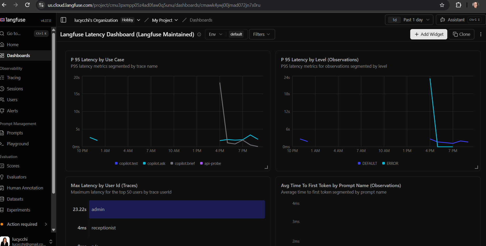
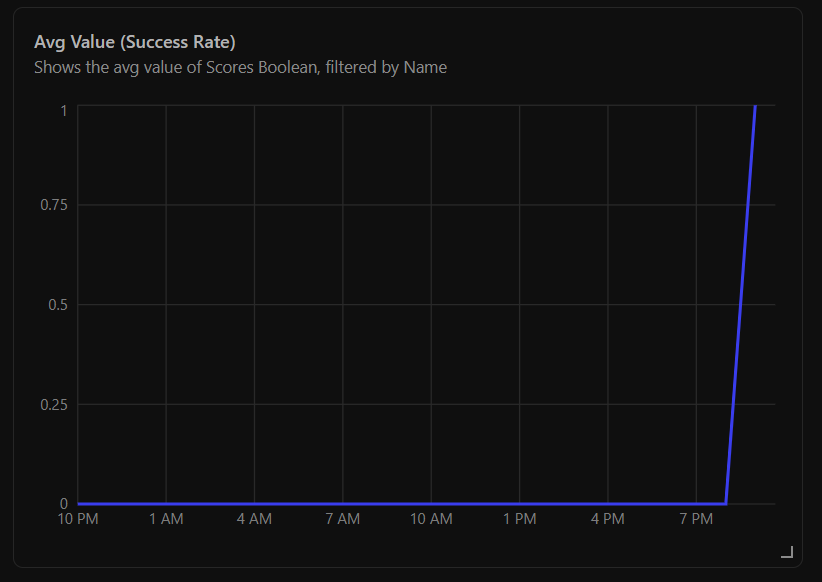

# DASHBOARD.md — Clinical Co-Pilot observability dashboard

> Week 2 (sidecar workers, document extraction, retrieval, the pre-warm queue) is documented in [../clinical_copilot_week2/DASHBOARD.md](../clinical_copilot_week2/DASHBOARD.md); this file remains the Week 1 record.

The dashboard lives in Langfuse Cloud (`us.cloud.langfuse.com`, project
"My Project", org "lucycchi's Organization"). It reads the trace, span,
generation and score events the module writes on every request
([`Ops/LangfuseTracer`](../interface/modules/custom_modules/oe-module-clinical-copilot/src/Ops/LangfuseTracer.php);
see [ARCHITECTURE.md § Observability](ARCHITECTURE.md#observability)).
Screenshots are in [`images/`](images/); each widget below names the
field it reads so it can be rebuilt from scratch.

## What the module sends, per request

| Event | Contents a widget can read |
|---|---|
| Trace (`copilot.brief` / `copilot.ask`, id = correlation id) | `userId`, `duration_ms`, `http_status`, `status`, `facts`, `stripped`, `omitted`, `from_cache`, `total_failure`, `answer_type`, `chart_changed`, `verification_pass`, `prompt_tokens`, `completion_tokens`, `cost_usd`, `llm_attempts`, `llm_retried`, tag `clinical-copilot`; on a `brief` that was compared with a pre-warm receipt also `warm_result`, `warm_reason`, `warm_run_id`, `warm_provider`, `warm_generated_at`, `warm_new_fact_ids`, `warm_gone_fact_ids` |
| Span per tool step (`authorize_and_assemble_facts`, `warm_lookup`, `cache_lookup`, `llm.briefing`, `llm.follow_up`, `verify`, `cache_store`, `omission_guard`, `scope_check`) | `level` DEFAULT / ERROR, `statusMessage` (the exception), `duration_ms`, step detail (`hit`, `attempts`, `kept`, `stripped`, `appended`…) |
| Generation (`copilot.<action>.llm`, when the model ran) | `model`, `usage.input` / `usage.output` / `usage.totalCost`, latency, `level` ERROR on failure |
| Boolean scores | `request_ok` (false on 5xx or a served request with non-null `status`), `verification_pass` (false when every sentence was stripped or the summary was unavailable), `tool_ok` (false when any step span errored), `warm_hit` (only on chart opens compared with a pre-warm receipt: true when the receipt's facts hash, prompt version and model matched) |

Nothing else leaves the server: no fact values, narration text, question
text or patient identifiers other than the OpenEMR user name.

## Latency

Langfuse's maintained "Latency Dashboard", filtered to this project
(past day, 2026-09-16/17, which includes the load-test window 02:45–03:03
UTC — the spike to ~17 s on `copilot.brief` and ~24 s on ERROR-level
observations is the 50-user MariaDB-connection saturation documented in
[BASELINES.md](BASELINES.md)).

| Widget | Reads | Answers |
|---|---|---|
| P95 Latency by Use Case | trace latency, segmented by trace name (`copilot.brief`, `copilot.ask`, `copilot.test`, `api-probe`) | p95 "time to summary" per action — the p95-latency alert's metric ([ALERTS.md § 1](ALERTS.md)) |
| P95 Latency by Level (Observations) | observation latency, segmented by `level` (DEFAULT / ERROR) | whether failed tool steps are the slow ones (timeouts) or fast ones (refusals) |
| Max Latency by User Id (Traces) | trace latency by `userId` | which user hit the worst case (`admin` 23.2 s during the load test; `receptionist` 4 ms — an ACL refusal never reaches the model) |
| Avg Time To First Token by Prompt Name | generation TTFT | n/a for this module (no streaming, no Langfuse prompt management) — shown empty |

## Error rate (success share)

Custom widget: data source **Scores (boolean)**, metric **avg value**,
filter `name = request_ok`. A boolean averaged is the share of `true`, so
1.0 means every request in the bucket succeeded; the error-rate alert
fires when this drops below 0.95 ([ALERTS.md § 2](ALERTS.md)). The line
sits at 0 until ~19:30 local (04:17 UTC) because the score did not exist
before the deploy that introduced it; the first bucket with data reads
1.0 (9 of 9 requests ok). An empty bucket also renders as 0 here, which is
why the alert rule's no-data handling is "keep previous severity".

## Widgets that complete the required set

The requirement lists total requests, error rate, p50/p95 latency, tool
call counts, retry counts and verification pass/fail rate. The two
captured above cover p95 latency and error rate. The remaining widgets are
built with **Add Widget** on the same dashboard from the fields the
module already sends; their definitions, so they can be added without
guessing:

| Widget | Data source | Metric | Filter / segment |
|---|---|---|---|
| Total requests | Traces | count | tag `clinical-copilot`; segment by name (`copilot.brief` vs `copilot.ask`) |
| p50 latency | Traces | p50 latency | same; pairs with the p95 widget above |
| Tool call counts | Observations | count | type = SPAN, segment by observation name (one bar per tool step) |
| Tool failures | Observations | count | type = SPAN, `level = ERROR`, segment by name — the tool-failure alert's numerator ([ALERTS.md § 3](ALERTS.md)); as a rate use Scores (boolean) `tool_ok` avg |
| Retry count | Traces | count | metadata `llm_retried = true` (or sum of metadata `llm_attempts` minus model calls) |
| Verification pass rate | Scores (boolean) | avg value | `name = verification_pass` |
| Model calls, tokens, cost | Observations | count / sum `usage.input` + `usage.output` / sum `totalCost` | type = GENERATION, segment by `model` |
| Cache hit share | Traces | count | metadata `from_cache = true` vs `false` |
| Refusals | Traces | count | metadata `denied = true` (HTTP 403) |

"Queue depth" is not applicable: requests are synchronous PHP with no
queue; the nearest analogue is concurrent in-flight requests, which the
load-test baselines capture as Apache/MariaDB saturation
([BASELINES.md](BASELINES.md)).

## Freshness

Langfuse Cloud ingests this project's traces through the v3 ingestion
API (deprecated for trace events from 2026-11-16, scores unaffected);
data appears within a few minutes rather than instantly. Moving the
tracer to the OTel endpoint is tracked in
[`TODOS.md`](../TODOS.md) and removes that lag.
